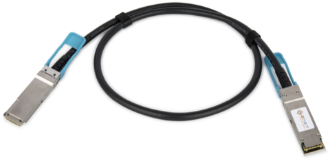

## Document Structure

This guide is organized into the following sections:

1. [Bandwidth Requirements](#bandwidth-requirement-for-signal-streaming) - Explains the bandwidth calculation for I/Q signal streaming
2. [NI USRP B2x0](#ni-usrp-b2x0) - USB 3.0 connectivity
3. [NI USRP N2x0](#ni-usrp-n2x0) - 1GbE connectivity
4. [NI USRP X3x0 Series](#ni-usrp-x3x0-series) - dual-10GbE connectivity
5. [NI USRP N3xx Series](#ni-usrp-n3xx-series)
   - [N300 and N310](#n300-and-n310) - Dual-10GbE connectivity
   - [N320 and N321](#n320-and-n321) - Dual-10GbE or QSFP+ connectivity
6. [NI USRP E320](#ni-usrp-e320) - 10GbE connectivity
7. [NI USRP X4xx Series](#ni-usrp-x4xx-series) - Dual-100GbE connectivity
8. [Commons of MPM Architecture Devices](#commons-of-mpm-architecture-devices-e320n3xxx4xx) - RJ45 and USB Console JTag ports of E320, N3xx and X4xx

Each section provides detailed information about the connection methods, required hardware, and performance considerations for the respective USRP model.

## Bandwidth Requirement for Signal Streaming

Understanding the bandwidth required for transmitting I/Q signals is crucial for comprehending why USRP devices continually upgrade their network interfaces, as well as understanding why *mismatched connections can trigger various transmission issues*.

Here is the equation, which calculates the **total bandwidth requirement for transmitting I/Q signals**:

$$B = F_S \times N_{ch} \times b_{WT}$$

Where:
- $B$ is the total bandwidth required (bits/s)
- $F_S$ is the sampling rate (number of I/Q samples/s)
- $N_{ch}$ is the number of channels (This is hardware channel. Don't confuse with the *Wi-Fi channels*.)
- $b_{WT}$ is the number of bits per I/Q sample. $b_{WT}$ can be two values:
  - 32-bit: Most USRPs use 16-bit I/Q wire-transfer format, i.e., 2 bytes for I and 2 bytes for Q;
  - 16-bit: N2x0 also supports 8-bit I/Q wire-transfer format, however, this degrades the signal quality.

For example:
- The N2x0's master clock rate (MCR) is 100 MHz, however, sampling at 100 MHz sampling rate requires: $B = 100\text{M} \times 1 \times 32 = 3.2 \text{ Gbps}$, which is far beyond the capacity of a 1GbE connection.
- The X3x0's MCR is 200 MHz, thus sampling the two channels at 200 MHz requires: $B = 200\text{M} \times 2 \times 32 = 12.8 \text{ Gbps}$. This is beyond the capacity of a single 10GbE connection, which is why the X3x0 adopts dual-SFP+ for dual-10GbE connections.
- The X410's maximum MCR is 500 MHz (with `CG_400` FPGA image). The maximum bandwidth requirement for sampling 4 channels would be: $B = 500\text{M} \times 4 \times 32 = 64 \text{ Gbps}$. This massive bandwidth requirement explains why the X410 utilizes high-speed 100GbE connections to handle the data throughput.
- In contrast, the HackRF One has a maximum sampling rate of 20 MHz and uses 8-bit I/Q transfer format (16 bits per sample): $B = 20\text{M} \times 1 \times 16 = 320 \text{ Mbps}$. This bandwidth requirement is well within the capacity of USB 2.0 (480 Mbps), which explains why HackRF One can operate effectively with a USB 2.0 connection.

## NI USRP B2x0

All B2x0 series devices are connected using a **USB 3.0 cable**. It is important to note that USB 3.0 cables can be identified by their *blue-colored "tongue"* and the presence of *five additional contacts inside the connector* compared to USB 2.0.

  
  
USB 3.0 cable for connecting NI USRP B2x0 devices

::: tip
The USB 3.0 connection significantly limits the B2x0's maximum sampling rate, specifically to 28 MHz sampling rate for two channels, or 56 MHz for a single channel. To fully utilize the performance of the AD9361 frontend, consider the [NI USRP E320](#ni-usrp-e320), which avoids this limitation with a 10GbE connection.
:::

## NI USRP N2x0

The NI USRP N2x0 utilizes a **1GbE Ethernet** port for connectivity with the host computer. Simply use a Cat 6 Ethernet cable to connect the RJ45 ports of both the N2x0 and your host computer.

  
  
Cat 6 Ethernet Cable for connecting NI USRP N2x0 devices

::: info
As described in [Bandwidth Computation](#bandwidth-requirement-for-signal-streaming), the 1GbE connection significantly limits the N2x0's maximum sampling rate, specifically to 25 MHz with 16-bit wire-transfer format, or 50 MHz with 8-bit format.
:::

## NI USRP X3x0 series

The NI USRP X3x0 series devices (X300 and X310) use **dual-SFP+ interfaces** for signal streaming, supporting up to **dual-10GbE** connection with `XG` firmware. With this dual-10GbE connection, the X3x0 can transmit and receive I/Q streams from dual channels with up to 200 MSPS rate.

The following is our recommended connection solution based on our long-term practice, balancing performance, reliability, and low risk of physical damage.

### Cable & Connector for 10GbE Connection

**SFP+ DAC (Direct Attach Copper) Cable** is our preferred choice. It features integrated SFP+ connectors on both ends, which enhances robustness and minimizes the risk of physical damage. It is both cost-effective and highly reliable. Additionally, since the SFP+ connectors are directly attached to the cable, you don't need to worry about losing adapters.

  
  
SFP+ DAC cable is recommended for connecting NI USRP X3x0 devices

Alternatives (not recommended):
    
1. **RJ45 Cable + Dual SFP+ to RJ45 Adapters**: This setup allows the use of standard Ethernet cables with SFP+ ports but tends to be more expensive. The adapters are separate components that need to be kept track of, and improper use of RJ45 adapters can damage the SFP+ interfaces.

2. **Separate Optical Cable and SFP+ Optical Transceivers**: This option involves using individual optical cables and SFP+ optical transceivers at each end. It allows for significantly longer connection distances without compromising signal quality. However, it is more expensive and requires careful handling of the optical cables to avoid physical damage. There is also a risk of misplacing the adapters.

3. **SFP+ AOC Cable**: Similar to the DAC cable, the SFP+ AOC (Active Optical Cable) incorporates fiber optics, which makes it more costly and more prone to physical damage.

### 10GbE NIC Solution

#### Quad-10GbE Connectivity for Desktop Computer

For desktop computers, we strongly recommend the **Intel X710-DA4 Quad-Port 10GbE** Ethernet NIC. Unlike cheaper single or dual-port 10GbE NICs that limit you to a single USRP device, this quad-port NIC enables true multi-USRP operation. We have tested it to simultaneously operate two USRP X3x0 devices (or a single X410 device), supporting clock-synchronized four channels with a 200 MSPS rate (250 MSPS for the X410) for both transmission and reception. The system achieves impressive peak throughput rates of up to 2 GB/s for both sending and receiving data, making it significantly more capable than basic single/dual-10GbE NICs.

  
  
Intel X710-DA4 Quad-Port 10GbE NIC for desktop computers

#### Single 10GbE Connectivity for Laptop with Thunderbolt 3+ Port

For laptops equipped with Thunderbolt 3+ ports, we utilize the **QNAP QNA-T310G1S Thunderbolt 3 to 10GbE SFP+** NIC. This NIC has been tested to operate one USRP X3x0 device (or a single X410 device), supporting one channel with a 200 MSPS rate (250 MSPS for the X410) for both transmission and reception. The system can achieve peak throughput rates of up to 480 MB/s for both sending and receiving data.

  
  
QNAP QNA-T310G1S adapter for Thunderbolt 3+ laptops

::: warning
We have tested that you CANNOT achieve dual-10GbE streaming by just using two such adapters.
:::

#### Dual 10GbE Connectivity for Laptop with Thunderbolt 3+ Port

The **Sonnet Twin10G SFP28 Thunderbolt Adapter** is a *possible* solution. This adapter provides two SFP+ ports through a single Thunderbolt connection, potentially enabling the operation of a dual-channel USRP X3x0 device at full capacity.

  
  
Sonnet Twin10G SFP28 Thunderbolt Adapter for dual 10GbE connections

::: info
We do NOT test this solution ourselves. If you have successfully achieved dual-10GbE streaming using this device, please let us know and we will update this page.
:::

#### Single 10GbE Connectivity for Laptop without Thunderbolt 3+ Port

For laptops without Thunderbolt 3+ ports, an **M.2-to-10GbE adapter** is perhaps the last available solution. However, this approach has serious limitations:

1. **M.2 Slot Usage**: Requires one M.2 slot, typically used for SSD storage
2. **Physical Risk**: Cannot properly close the laptop's back panel, risking physical damage

  
  
M.2-to-10GbE adapter - use with caution

::: warning
We do NOT test this solution ourselves. For serious USRP-based research and development, we strongly recommend using either a desktop computer or a laptop with Thunderbolt 3+ ports. However, if you have successfully implemented this solution, please let us know and we will update this page.
:::

### 1GbE Mode: Severely Limited Performance

The 1GbE mode (SFP+ Port 0 under `HG` firmware), which comes enabled by default for initial hardware setup purposes, severely restricts data streaming capabilities. As detailed in the [Network Bandwidth Calculation](#bandwidth-requirement-for-signal-streaming), this mode only supports a single channel with sampling rates below 25 MSPS - **far below the device's full potential**. Due to these significant bandwidth limitations, 1GbE mode should never be used for serious research or development work. It should only be utilized during initial device setup and basic connectivity testing.

### PCIe Interface? Not Recommended!

Besides Ethernet connectivity, the NI USRP X3x0 series also provides a direct PCIe connection option through the "PCIe Connectivity Kit". However, we strongly advise **AGAINST** using this solution. The PCIe cable and host-side card are prohibitively expensive, and most importantly, **this interface does NOT support multi-USRP combination**.

## NI USRP N3xx Series 

### N300 and N310

The N300 and N310 models feature the same **dual-SFP+ interfaces** as the X3x0 for signal streaming, supporting up to **dual-10GbE** connections. For details, refer to the [NI USRP X3x0 section](#ni-usrp-x3x0-series).

### N320 and N321

The N320 and N321 models feature **dual-SFP+ interfaces** and an additional **QSFP+ interface**. For dual-SFP+ interfaces, refer to the [NI USRP X3x0 section](#ni-usrp-x3x0-series). Regardless of the connection type used, it is necessary to flash the `XG` firmware to achieve dual-10GbE connections.

#### QSFP+ based Connectivity

Although the QSFP+ interface (literally quad-lane SFP+) supports 4 $\times$ 10GbE, the N320 and N321 models only utilize two lanes, making it equivalent to a dual-10GbE connection.

We use a **QSFP+ to 4x SFP+ Breakout Cable** to connect N320 and N321 to the [host-side Intel X710 NIC](#quad-10gbe-connectivity-for-desktop-computer).

  
  
QSFP+ to 4x SFP+ Breakout Cable for connecting NI USRP N320 and N321

### MPM Architecture

The N3xx utilizes the MPM (Modular Peripheral Manager) architecture. For details on properly using its high-speed SFP+/QSFP+ ports, RJ45 port, and USB Console JTAG port, please refer to the [Commons of MPM Architecture Devices](#commons-of-mpm-architecture-devices-e320n3xxx4xx) section.

## NI USRP E320

The E320 model utilizes a single **SFP+ interface** for signal streaming, supporting up to **10GbE** connection. This setup aligns with the connectivity approach used for the X3x0 model. For details, refer to the [NI USRP X3x0 section](#ni-usrp-x3x0-series).

The E320 utilizes the MPM (Modular Peripheral Manager) architecture. For details on properly using its high-speed 10GbE port, RJ45 port, and USB Console JTAG port, please refer to the [Commons of MPM Architecture Devices](#commons-of-mpm-architecture-devices-e320n3xxx4xx) section.

## NI USRP X4xx Series

The X4xx series devices, X410 and X440, are equipped with **dual QSFP28 interfaces**, supporting up to **dual-100GbE** connections. When paired with the `CG_400` firmware, the X410 supports simultaneous 500 MSPS Tx and Rx across four channels. When paired with the `CG_1600` firmware, the X440 supports up to 2 GSPS Tx and Rx on a single channel. 

### Host-Side Ethernet Solutions

We provide two proven solutions for connecting X4xx devices, each suited for different performance requirements.

#### Solution 1: Dual-100GbE Connection for Desktop (Recommended)

Our recommended solution utilizes the **Mellanox/NVIDIA ConnectX-5 EX (MCX516A-CDAT)** NIC. This dual-port QSFP28 card supports both 40GbE and 100GbE modes through its PCIe Gen4 x16 interface, offering maximum performance and future-proofing capabilities. This NIC has been *officially tested by NI to achieve the maximum performance* claimed by X4xx devices.

  
  
Mellanox/NVIDIA ConnectX-5 EX dual-port 100GbE NIC

For connectivity, we recommend using **QSFP28 DAC cables**. The number of cables needed depends on your FPGA image, See [Choose FPGA Image](#choose-fpga-image).

::: info
Solution 1 is recommended for high-performance applications but is exclusive to X4xx devices.
:::

  
  
QSFP28 DAC cable for 100GbE connections

#### Solution 2: Quad-10GbE Connection for Desktop

We reuse the [**Intel X710-DA4 Quad-Port 10GbE**](#quad-10gbe-connectivity-for-desktop-computer) NIC for this solution. This approach is particularly valuable for working with multiple USRP generations, as the same NIC can be used with X3x0 and N3x0 devices. The connection requires a [**QSFP+ to 4x SFP+ breakout cable**](#qsfp-based-connectivity), which connects the X4xx's QSFP28 Port 0 (operating in 40GbE with `X4_200` FPGA image) to the NIC's four SFP+ ports.

::: info
Although limited to 250 MSPS per channel, Solution 2 is more convenient for working with other USRP models, like E320, X3x0 and N3xx.
:::

#### Solution 3: Single/Dual-10GbE Connection for Laptop

For laptops with Thunderbolt 3+ ports, we recommend using the same solutions as described in the [NI USRP X3x0 section](#ni-usrp-x3x0-series):

1. **Single 10GbE Connection**: Use the [**QNAP QNA-T310G1S Thunderbolt 3 to 10GbE SFP+**](#single-10gbe-connectivity-for-laptop-with-thunderbolt-3-port) NIC. This setup supports one channel with a 250 MSPS rate (with `X4_200` FPGA image) for both transmission and reception.

2. **Dual 10GbE Connection**: The [**Sonnet Twin10G SFP28 Thunderbolt Adapter**](#dual-10gbe-connectivity-for-laptop-with-thunderbolt-3-port) is a *possible* solution for dual-channel operation. However, we have not tested this configuration ourselves.

::: warning
For laptops without Thunderbolt 3+ ports, we strongly recommend using a desktop computer instead of attempting to use M.2-to-10GbE adapters. The performance limitations and physical risks associated with M.2 adapters make them unsuitable for serious USRP development.
:::

### Choose FPGA Image

The choice of FPGA image determines both the device's capabilities and its network requirements:

The standard performance images (`UC_200` and `X4_200`) support sampling rates up to 250 MSPS per channel. These images enable the built-in DUC/DDC (Digital Up/Down Conversion), allowing devices to operate at multiple sampling rates: 250, 125, 83.333, 62.5, 50, 25 MHz, etc. Note that `UC_200` works exclusively with Solution 1, while `X4_200` only works with Solution 2.

The high-performance images (`CG_400` and `CG_1600`) require Solution 1's dual-100GbE connectivity to achieve maximum hardware capabilities. The `CG_400` enables impressive 500 MSPS operation across all four channels on the X410, while the `CG_1600` pushes the X440 to its limits with up to 2 GSPS on a single channel. However, to achieve these peak performance levels, these images bypass the DUC/DDC (Digital Up/Down Conversion) functionality. As a result, unlike the `UC_200`/`X4_200` images that offer flexible sampling rate options, devices running high-performance images can only operate at their maximum sampling rates.

::: warning
High-performance images place extreme computational demands on the host computer. Using them indiscriminately will lead to severe performance bottlenecks. Only use `CG_400` or `CG_1600` images when sampling rates above 250 MSPS are *truly needed* for your application.
:::

### MPM Architecture

The X4xx utilizes the MPM (Modular Peripheral Manager) architecture. For details on properly using its high-speed QSFP28+ ports, RJ45 port, and USB Console JTAG port, please refer to the [Commons of MPM Architecture Devices](#commons-of-mpm-architecture-devices-e320n3xxx4xx) section.

## Commons of MPM Architecture Devices (E320/N3xx/X4xx)

The E320, N3xx, and X4xx series devices employ an advanced architecture known as the Modular Peripheral Manager (MPM). This architecture integrates two key components:

1. **Processing System (PS)**: An ARM-based Linux system that handles device management, configuration, and control
2. **Programmable Logic (PL)**: An FPGA that processes the I/Q signals and handles high-speed data streaming

This dual-system design provides robust device management capabilities while maintaining high-performance signal processing. However, it also introduces some important considerations regarding device connectivity and management.

### RJ45 Port: Only for Management and Connectivity Test

The RJ45 port provides direct access to the embedded Linux system (PS), enabling users to perform essential device management tasks such as firmware updates, network configuration, system monitoring, and initial setup verification.

While this port can technically handle signal streaming, we **strongly recommend against using it for data transmission** for several critical reasons:

1. **Bandwidth Constraints**: The 1GbE RJ45 connection significantly limits throughput, preventing the device from reaching its full potential
2. **Increased Latency**: Data must traverse through the Linux system (PS) before reaching the FPGA (PL), adding substantial processing delays
3. **Degraded Performance**: The data path between PS and PL creates performance bottlenecks, leading to timing inconsistencies and reduced data rates

### USB Console JTAG: Emergency Recovery Interface

The USB Console JTAG port enables **direct serial communication with the embedded Linux system**. While users typically interact with the device via SSH over Ethernet during normal operation, this port serves as a **critical recovery mechanism** in situations where SSH connectivity becomes unavailable.

### DANGER: Never Use SFP+/QSFP+/QSFP28+ for Device Management!

**Never attempt device management operations through SFP+/QSFP+/QSFP28+ ports**. These high-speed interfaces are designed exclusively for signal streaming, and using them for device management tasks can lead to serious consequences including abrupt connection termination, failed updates, device bricking, or permanent hardware damage. For all device management operations, **always use the dedicated RJ45 port or USB Console JTAG interface**.