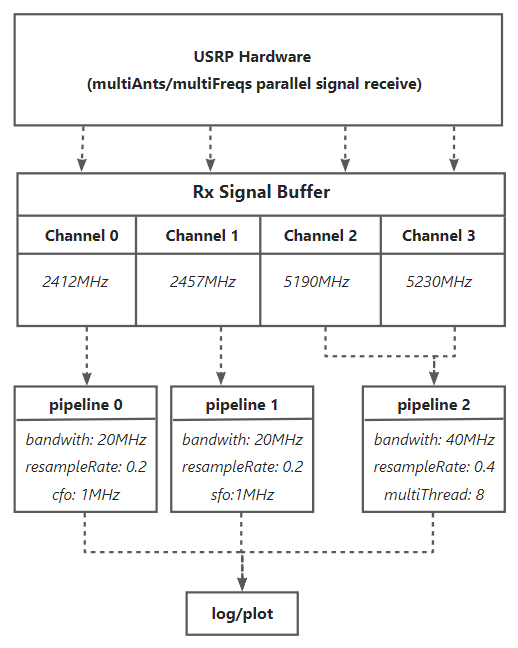

# PicoSenses Rx MultiPipeline 

This page introduces the **PicoScenes Rx-side pipeline** and provides a tutorial on **multi-pipeline** configuration.

## PicoSenses Pipeline in Signal Processing Workflow

1. **Signal Reception**
   - The USRP or NIC captures Wi-Fi signals.
2. **Signal Buffering**
   - PicoScenes stores the received multi-channel signals in the Rx-side buffer.
3. **Pipeline Processing**
   - Pipelines fetch and decode Wi-Fi packets from the buffer.
   - Each pipeline can decode signals from a single channel or multiple channels.
   - Multiple pipelines work in parallel to decode signals from different channels.

## 

## Why MultiPipeline?

One breakthrough in Wi-Fi 7 is **Multi-Link Operation (MLO)**, enabling devices to simultaneously access and use multiple frequency bands (e.g., 2.4 GHz, 5 GHz, 6 GHz). By intelligently scheduling data transmission at the link layer, MLO achieves parallel data transfer, significantly boosting throughput and reducing latency.

Similarly, PicoScenes provides a flexible framework for multi-pipeline configuration. Users can:

1. **Process Multiple Channels in Parallel**: Run pipelines simultaneously across different frequencies/channels.
2. **Customize Pipelines:** adjustable parameters:
   - *Resampling rate*
   - *Bandwidth*
   - *Number of decoding threads*
   - *Carrier frequency offset (CFO) correction*
   - *Sampling frequency offset (SFO) compensation*

## How to Config MultiPipeline?

PicoScenes provides two command-line methods to set up Multi-Pipeline:

1. **`--rx-pipe`**

Assigns receive (Rx) channels to pipelines.

**Syntax:**

- Separate different pipelines with commas `,`
- Assign multiple channels to one pipeline with underscores (`_`).

**Note:**

 - Channel numbers must match those in `--rx-channel`.
 - Cannot be used with `--rx-pipe-cfg-file` (this will override `--rx-pipe`).
 - Only assigns channels—other parameters (bandwidth, decoding threads, etc.) remain unchanged.

**Example:**

**Two pipelines, one channel each:**

```bash
PicoScenes -d debug -i usrp --mode logger --rate 100e6 --rx-cbw 40 --rx-resample-ratio 0.4 --rx-freq 5190,5230 --rx-channel 0,1 --rx-pipe 0,1
```

**Single pipeline, two channels:**

```bash
PicoScenes -d debug -i usrp --mode logger --rate 100e6 --rx-cbw 40 --rx-resample-ratio 0.4 --rx-freq 5190,5230 --rx-channel 0,1 --rx-pipe 0_1
```

2. **`--rx-pipe-cfg-file`**

Specify the JSON config file path.The config file specify receive (Rx) channel(s) and other property config to each pipeline.

**Format**: 

1. The file content like:

```
[
  {
  	pipeline1 config
  },
  {
  	pipeline2 config
  },
  ...
]
```

 2. the property :

    `rx-channel` :must be specified,can be single channel number or multi channel number. Specify the pipeline occupied which channels.

​	Other parameters have default value:` rx-resample-ratio = 1  rx-cbw = 20  rx-iq-mismatch = [0,0]  mt = 1  sfo = 0  cfo = 0`

**Example**: 

```bash
PicoScenes -d debug -i usrp --mode logger --rate 100e6  --rx-freq 5230,5190 --rx-channel 0,1 --rx-pipe-cfg-file ~/cfg.json
```

~/cfg.json: The content bellow specify a pipeline occupies 0,1channel, both use rx-resample-ratio=0.2,mt=8,rx-cbw=20.

```json
[
    {
        "rx-channel": [0,1],
        "rx-resample-ratio": 0.2,
        "rx-cbw": 20,
        "mt": 8,
    }
]
```

 ~/cfg.json: The content bellow specify two pipelines occupy channels 0 and 1 respectively,and each has more detailed parameter configurations.

  ```json
  [
    {
    "rx-channel": 0,
    "rx-resample-ratio": 0.4,
    "rx-cbw": 40,
    "mt": 8,
    "cfo": 0,
    "rx-iq-mismatch": [0,0]
    },
    {
    "rx-channel": 1,
    "rx-resample-ratio": 0.4,
    "rx-cbw": 40,
    "mt": 4,
    "sfo": 0
    }
  ]
  ```


