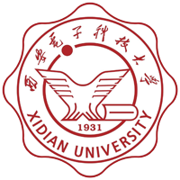

--- 
title: Credits
autoNumbering: true
startNumber: 15
---

## Development Team

The creation of PicoScenes is the result of collaborative efforts of the following members.

|  |  |  |
|:---:|:---:|:---:|

### Xidian University

- Prof. Zhiping Jiang, 蒋志平 (Associate Professor with the School of Computer Science and Technology)
- Yonghui Duan, 段永辉 (Graduate student with the School of Computer Science and Technology)
- Qijian Yu, 于岂健 (Graduate student with the School of Computer Science and Technology)
- Kaiyu Wang, 王凯瑜 (Graduate student with the School of Computer Science and Technology)
- Qiulin Jiang, 蒋秋林 (Graduate student with the School of Computer Science and Technology)
- Bingxiang Huangfu, 皇甫丙祥 (Graduate student with the School of Computer Science and Technology)
- Yundong Li, 李云东 (Graduate student with the School of Computer Science and Technology)
- Lanqi Yang, 杨兰琪 (Graduate student with the School of Computer Science and Technology)
- Minghao Xu, 许明晧 (Graduate student with the School of Computer Science and Technology)
- Xuelin Zhang, 张雪林 (Graduate student with the School of Computer Science and Technology)
- Junhao Duan, 段钧豪 (Graduate student with the School of Computer Science and Technology)
- Prof. Rui Li, 李瑞 (Professor with the School of Computer Science and Technology)
- Prof. Tom H. Luan, 栾浩 (Professor with the School of Cyber Engineering)

#### Leaved students

- Xu Wang, 王旭 (Ph.D student with the School of Computer Science and Technology)
- Chen He, 何琛 (Graduated student with the School of Computer Science and Technology)
- Xincheng Ren, 任新承 (Graduated student with the School of Computer Science and Technology)
- Dongtao Lv, 吕东涛 (Graduated student with the School of Computer Science and Technology)
- Xuetao Li, 李薜滔 (Graduated student with the School of Computer Science and Technology)
- Tian Teng, 滕天 (Graduated UG student with the School of Computer Science and Technology)

### Xi'an Jiaotong University

- Han Hao, 蒿翰 (Ph.D student with the School of Computer Science and Technology)
- Prof. Wei Xi, 惠维 (Professor with the School of Computer Science and Technology)
- Prof. Jizhong Zhao, 赵季中 (Professor with the School of Computer Science and Technology)
- Dr. Kun Zhao, 赵鲲 (Assistant professor with the School of Computer Science and Technology)

### Zhejiang University

- [Prof. Jinsong Han](https://person.zju.edu.cn/en/hanjinsong), 韩劲松 (Professor with the Institute of Cyberspace Research, College of Computer Science and Technology)

## Open-source software

PicoScenes are built upon many open-source software libraries. Their license information is at [opensource_license](opensource_license.md).
