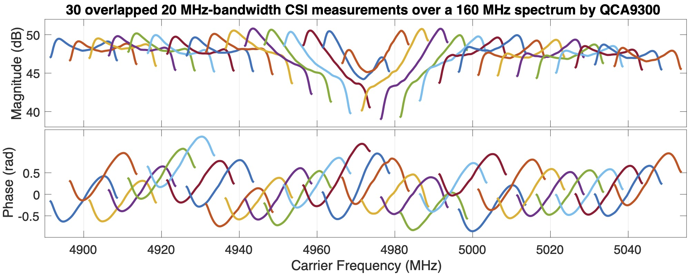
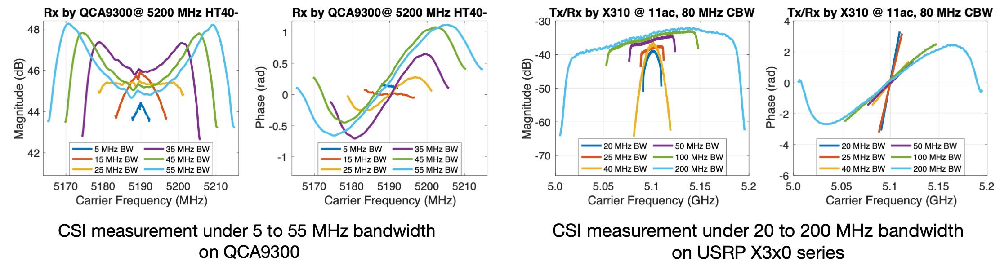
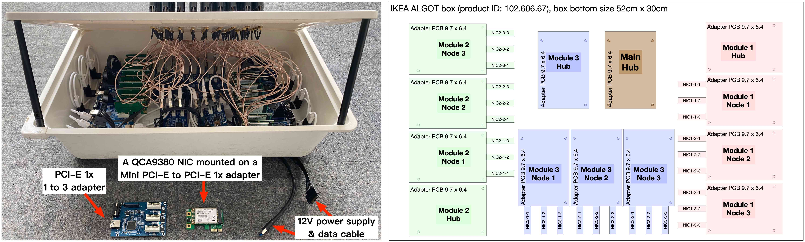

## PicoScenes Driving USRP B210 and HackRF One to Inject 11AX Packets and Measuring CSI (1 & 2)

This is the fourth and fifth short demo video presented at the [CPS-IOT Week'2022 tutorial](https://zpj.io/give-tutorial-talk-on-picoscenes-at-cps-iot-week-2022/).

YouTube:

<iframe width="800" height="450" src="https://www.youtube.com/embed/0x-ri8323es" title="PicoScenes Driving USRP B210 and HackRF One to Inject 11AX Packets and Measuring CSI" frameborder="0" allow="accelerometer; autoplay; clipboard-write; encrypted-media; gyroscope; picture-in-picture" allowfullscreen></iframe>

<iframe width="800" height="450" src="https://www.youtube.com/embed/OKwOsIKSCGo" title="PicoScenes Driving USRP B210 and HackRF One to Inject 11AX Packets and Measuring CSI 2" frameborder="0" allow="accelerometer; autoplay; clipboard-write; encrypted-media; gyroscope; picture-in-picture" allowfullscreen></iframe>

Bilibili:

<iframe src="//player.bilibili.com/player.html?aid=383047528&bvid=BV1734y1Y7Yp&cid=570756427&page=1" scrolling="no" border="0" framespacing="0" allowfullscreen="true" style="width: 800px; height: 450px; max-width: 100%; align:center; padding:20px 0;" frameborder="no"> </iframe>

<iframe src="//player.bilibili.com/player.html?aid=383047528&bvid=BV1k44y1u7TC&cid=570756427&page=1" scrolling="no" border="0" framespacing="0" allowfullscreen="true" style="width: 800px; height: 450px; max-width: 100%; align:center; padding:20px 0;" frameborder="no"> </iframe>

## Live CSI measurement and plot using HackRF One

PicoScenes supports the most cost-efficient SDR devices, HackRF One. With this only 200$ SDR, Wi-Fi sensing researchers can perform 802.11a/g/n/ac/ax packet injection, receive standard 20-MHz bandwidth packet in realtime, and access the complete PHY-layer information. For more information, please visit [PicoScenes now officially supports HackRF One](https://zpj.io/picoscenes-supports-hackrf/).

YouTube:

<iframe width="800" height="450" src="https://www.youtube.com/embed/L4OCDkU7Fnk" title="PicoScenes Now Supports HackRF One" frameborder="0" allow="accelerometer; autoplay; clipboard-write; encrypted-media; gyroscope; picture-in-picture" allowfullscreen></iframe>

Bilibili:

<iframe src="//player.bilibili.com/player.html?aid=383047528&bvid=BV17Z4y127Jx&cid=570756427&page=1" scrolling="no" border="0" framespacing="0" allowfullscreen="true" style="width: 800px; height: 450px; max-width: 100%; align:center; padding:20px 0;" frameborder="no"> </iframe>

## AX210 NIC in STA mode measuring the 160-MHz bandwidth CSI and live-plotting

This is the first short demo video presented at the [CPS-IOT Week'2022 tutorial](https://zpj.io/give-tutorial-talk-on-picoscenes-at-cps-iot-week-2022/).

YouTube:

<iframe width="800" height="450" src="https://www.youtube.com/embed/UaCHtzW3Pm8" title="AX210 NIC in STA mode measuring 160-MHz BW CSI and live-plotting" frameborder="0" allow="accelerometer; autoplay; clipboard-write; encrypted-media; gyroscope; picture-in-picture" allowfullscreen></iframe>

Bilibili:

<iframe src="//player.bilibili.com/player.html?aid=383047528&bvid=BV1Qa411a7GV&cid=570756427&page=1" scrolling="no" border="0" framespacing="0" allowfullscreen="true" style="width: 800px; height: 450px; max-width: 100%; align:center; padding:20px 0;" frameborder="no"> </iframe>

## AX210 NIC in Monitor Mode measuring CSI for all overheard frames and live-plotting 

This is the second short demo video presented at the [CPS-IOT Week'2022 tutorial](https://zpj.io/give-tutorial-talk-on-picoscenes-at-cps-iot-week-2022/).

YouTube:

<iframe width="800" height="450" src="https://www.youtube.com/embed/btUCq68cews" title="AX210 NIC in Monitor Mode measuring CSI for all overheard frames and live-plotting" frameborder="0" allow="accelerometer; autoplay; clipboard-write; encrypted-media; gyroscope; picture-in-picture" allowfullscreen></iframe>

Bilibili:

<iframe src="//player.bilibili.com/player.html?aid=383047528&bvid=BV1F3411N7kt&cid=570756427&page=1" scrolling="no" border="0" framespacing="0" allowfullscreen="true" style="width: 800px; height: 450px; max-width: 100%; align:center; padding:20px 0;" frameborder="no"> </iframe>

## AX210 NIC Measuring CSI in Monitor mode w/ 20/160-MHz BW Packet Injection from Another AX210

This is the third short demo video presented at the [CPS-IOT Week'2022 tutorial](https://zpj.io/give-tutorial-talk-on-picoscenes-at-cps-iot-week-2022/).

YouTube:

<iframe width="800" height="450" src="https://www.youtube.com/embed/_X6JVb69-MA" title="AX210 NIC  Measuring CSI in Monitor mode w/ 20/160-MHz BW Packet Injection from Another AX210" frameborder="0" allow="accelerometer; autoplay; clipboard-write; encrypted-media; gyroscope; picture-in-picture" allowfullscreen></iframe>

Bilibili:

<iframe src="//player.bilibili.com/player.html?aid=383047528&bvid=BV1sr4y187bL&cid=570756427&page=1" scrolling="no" border="0" framespacing="0" allowfullscreen="true" style="width: 800px; height: 450px; max-width: 100%; align:center; padding:20px 0;" frameborder="no"> </iframe>

## AX210 NIC Measuring CSI in Monitor mode w/ Round-trip CSI and Frequency Hopping

This is the last short demo video presented at the [CPS-IOT Week'2022 tutorial](https://zpj.io/give-tutorial-talk-on-picoscenes-at-cps-iot-week-2022/).

YouTube:

<iframe width="800" height="450" src="https://www.youtube.com/embed/xlHs4KfVSJQ" title="PicoScenes driving two AX210 NICs to perform round-trip CSI measuring with freq. hopping in 6G band" frameborder="0" allow="accelerometer; autoplay; clipboard-write; encrypted-media; gyroscope; picture-in-picture" allowfullscreen></iframe>

Bilibili:

<iframe src="//player.bilibili.com/player.html?aid=383047528&bvid=BV1xS4y1h7Bk&cid=570756427&page=1" scrolling="no" border="0" framespacing="0" allowfullscreen="true" style="width: 800px; height: 450px; max-width: 100%; align:center; padding:20px 0;" frameborder="no"> </iframe>

## CSI measurements over a large and continuous spectrum by QCA9300

PicoScenes unlocks the arbitrary tuning for carrier frequency for the QCA9300 NIC. More specifically, QCA9300 can operate at any carrier frequency between 2.2 to 2.9 GHz in the 2.4 GHz band and 4.4 to 6.1 GHz in the 5 GHz band. PicoScenes uses the `--freq` command option to specify the carrier frequency, e.g., `--freq 4900e6`.
For more details, you may refer to [The academic paper of PicoScenes](resources.html#the-academic-paper-of-picoscenes).



## CSI measurements under tunable and wide baseband bandwidths

For the QCA9300 NIC, PicoScenes unlocks the fine-grained tuning for baseband bandwidth from `5 to 80 MHz` with a minimum step of 2.5 MHz.
PicoScenes also provides `up to 200` MHz baseband bandwidth on the SDR devices. 
PicoScenes uses `--rate` command option to specify the baseband bandwidth for both the commercial Wi-Fi NIC and SDR frontends, e.g., `--rate 55e6`.
For more details, you may refer to [The academic paper of PicoScenes](resources.html#the-academic-paper-of-picoscenes).

## Large spectrum stitching using two QCA9300 NICs

This short video demonstrates the spectrum scanning and stitching using the PicoScenes platform and two QCA9300 NICs. I upload the same video to YouTube (for China mainland users).

YouTube:

<iframe width="800" height="450" src="https://www.youtube.com/embed/6KKxpc7fh2w" title="Large Spectrum Stitching using Two QCA9300 NICs" frameborder="0" allow="accelerometer; autoplay; clipboard-write; encrypted-media; gyroscope; picture-in-picture" allowfullscreen></iframe>

## Large spectrum stitching using A USRP X310 and a QCA9300 NIC

This short video demonstrates the spectrum scanning and stitching using the PicoScenes platform with one USRP X310 and a QCA9300 NIC. I upload the same video to YouTube (for China mainland users).

YouTube:

<iframe width="800" height="450" src="https://www.youtube.com/embed/RZUQ5Fm4LLc" title="Large spectrum stitching using A USRP X310 and a QCA9300 NIC" frameborder="0" allow="accelerometer; autoplay; clipboard-write; encrypted-media; gyroscope; picture-in-picture" allowfullscreen></iframe>

## Installation of PicoScenes MATLAB Toolbox and drag'n'drop style .csi file parsing

YouTube:

<iframe width="800" height="450" src="https://www.youtube.com/embed/zgDIn1cdvCo" title="Installation of PicoScenes MATLAB Toolbox and drag'n'drop style .csi file parsing" frameborder="0" allow="accelerometer; autoplay; clipboard-write; encrypted-media; gyroscope; picture-in-picture" allowfullscreen></iframe>

Bilibili:

<iframe src="//player.bilibili.com/player.html?aid=383047528&bvid=BV1NY4y1C79T&cid=570756427&page=1" scrolling="no" border="0" framespacing="0" allowfullscreen="true" style="width: 800px; height: 450px; max-width: 100%; align:center; padding:20px 0;" frameborder="no"> </iframe>

## 27-NIC Wi-Fi sensing array

To fully demonstrate the capacity of multi-NIC CSI measurement, we setup a 27-NIC Wi-Fi sensing array. The array contains 27 QCA9300 NICs and 10 1-to-3 PCI-E bridge adapters. For more details, you may refer to the evaluation part of [The academic paper of PicoScenes](resources.html#the-academic-paper-of-picoscenes).

