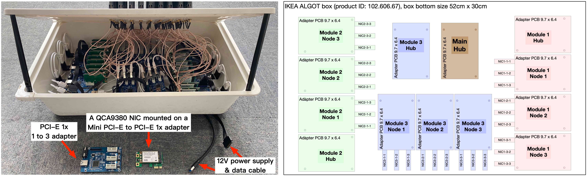
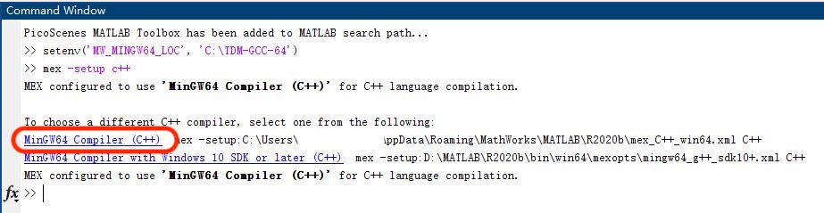
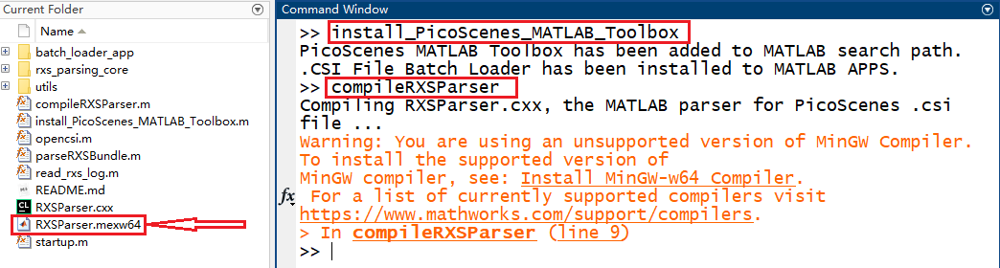

::: tip
如果您不想费劲地看英文，请开启浏览器的翻译功能，省脑子。
:::

## Hardware Installation

PicoScenes currently supports 4 commercial Wi-Fi NIC models and SDR devices, including the AX200 (or AX201), AX210(or AX211), QCA9300 and IWL5300, all models of USRP devices, and the HackRF One.

The most welcomed feature of PicoScenes is the concurrent operation of multiple RF frontends, i.e., simultaneous CSI measurement or packet injection using a commercial Wi-Fi NIC/SDR array. To help you get the hardware ready, we share some hardware preparation experience, mainly focusing on the multi-devices setup.

### Installation of (Multiple) Commercial Wi-Fi NICs

We recommend three methods for installing multiple NICs.

1. **PCI-E 1x Adapter-based Multi-NIC Installation**

   With the help of the `Mini PCI-E to PCI-E 1x adapter` or `M.2 to PCI-E 1x adapter`, you can install multiple NICs directly on the motherboard of a desktop PC.

   However, there are usually only 2 or 3 spare PCI-E slots left for the Wi-Fi NICs. To overcome this issue, you may choose **cryptocurrency mining motherboards**, such as the MSI B360-F Pro. These types of motherboards have dozens of PCI-E 1x slots, and you can use **PCI-E slot risers** to install *dozens* of Wi-Fi NICs on a single motherboard.

2. **Multi-Mini PCI-E/M.2 Slots-Based Multi-NIC Installation**

   This is the most convenient approach for installing multiple NICs. The onboard Mini PCI-E or M.2 slots eliminate the need for PCI-E 1x adapters.    
   With some hardware and software tricks, we modified an old laptop model, the ThinkPad X201, and installed two Mini PCI-E/M.2-based Wi-Fi NICs. Moreover, **the X201 enables you to install three SMA-based external antennas!** The following photo shows our modified ThinkPad X201 equipped with both the QCA9300 and IWL5300 NICs and three external antennas. The laptop can also install an AX210/AX200 using an M.2-to-Mini PCI-E converter.

   

3. **PCI-E Bridge Adapter-Based Multi-NIC Installation**

   The PCI-E bridge adapter can split one PCI-E connection into multiple connections, similar to a PCI-E hub. Therefore, you can connect multiple NICs to only one of the motherboard's PCI-E slots via the bridge adapter.

   Moreover, you can build a multi-layer hierarchy of bridge adapters and install NICs to all the leaf nodes. In this way, you can theoretically install over 100 Wi-Fi NICs in your system. To validate the feasibility of this approach, we built a 27-NIC Wi-Fi ISAC array using a 3-layer hierarchy of 1-to-3 PCI-E bridge adapters. The figure below shows the picture and layout of the 27-NIC array. The entire array is encapsulated in an IKEA box.    

   

::: tip
1. Do you want to access research-ready hardware out of the box? Do you want to skip the unfamiliar hardware selection, installation, and tricky setup? 

2. Get them from our Taobao shop [PicoScenes软硬件与服务](https://shop235693252.taobao.com/)! Our shop sells the modified ThinkPad X201 and all supported Wi-Fi NICs.
:::

### Installation of (Multiple) USRP Devices

The installation, usage, and optimization of USRP are much more complex than that of a COTS NIC. Therefore, please follow the steps below to configure and verify the USRP hardware.

#### Installing PicoScenes Software 

Before setting up the USRP hardware, you should install the PicoScenes software first. Please follow the instructions in the [PicoScenes Software Installation](#picoscenes-software-installation) section to install PicoScenes. Please note that PicoScenes depends on specific version of UHD. If you have previously installed your own compiled version of UHD, please uninstall it before proceeding.

::: tip
The driver installation or build process listed on the USRP Official site can be complicated and prone to errors. To simplify this process, we have built and packaged the PicoScenes software using the USRP driver shipped with the Ubuntu system. Therefore, by installing PicoScenes software, you will also be installing the USRP driver.
:::


#### Configuring USRP Hardware

You should set up your hardware according to the USRP official [Devices & Usage Manual](https://files.ettus.com/manual/page_devices.html). Read and follow the Get Started sections according to your USRP models.

- [USRP Hardware Driver and USRP Manual: B200/B210/B200mini/B205mini](https://kb.ettus.com/B200/B210/B200mini/B205mini)
- [USRP Hardware Driver and USRP Manual: USRP2 and N2x0 Series](https://files.ettus.com/manual/page_usrp2.html)
- [USRP Hardware Driver and USRP Manual: USRP X3x0 Series](https://files.ettus.com/manual/page_usrp_x3x0.html)
- [USRP Hardware Driver and USRP Manual: USRP N3x0 Series](https://files.ettus.com/manual/page_usrp_n3xx.html)
- [USRP Hardware Driver and USRP Manual: USRP X4x0 Series](https://files.ettus.com/manual/page_usrp_x4xx.html)
- [Multiple USRP configuration](https://files.ettus.com/manual/page_multiple.html)

::: tip
The PicoScenes software installer installs the UHD software. So, you skip the UHD installation or source code building steps.
:::

##### Suggestions for NI USRP Hardware Setup

Based on our experience, we have the following suggestions for setting up USRP hardware:

- X3x0 Series: It is **not recommended to use a PCI-E cable-based connection** due to inefficiency in both hardware and cost. This method has two major drawbacks. Firstly, the PCI-E-based connection is hardware-inefficient as it requires one cable or extension card for each X3x0 device. This can be very expensive and may not be feasible for a desktop PC with limited spare PCI-E slots. Secondly, the UHD software does not support a hybrid combination of the PCI-E-based link and the GbE/10GbE-based link, further limiting its application.

- X3x0 and N3x0 Series: We highly **recommend using 10GbE connection and the Intel X710 Quad Port 10 Gb Ethernet Adapter**. This is a reasonable and cost-effective solution for connecting multiple X3x0 and N3x0 devices. It occupies only one full-size PCI-E slot but provides four 10GbE ports, allowing you to connect up to four X3x0 or N3x0 devices.

- N2x0 Series: Consider using MIMO cables to achieve MIMO and phased array capabilities. However, note that MIMO cables have a narrow bandwidth.

- Multiple USRP Devices: As clearly stated in [Multiple USRP configuration](https://files.ettus.com/manual/page_multiple.html), UHD only supports combining multiple USRP devices of the same model. Currently, the N2x0 and X3x0 series are the only combination-ready models.

- Daughterboard Selection: For both the N2x0 and X3x0 series, it is advisable to consider using the UBX-40/UBX-160 daughterboard. Although these daughterboards are expensive, they are the only ones that support daughterboard-level phase synchronization, which is necessary for PicoScenes to achieve phased-array functionality.

- IP Address Allocation: Pay special attention to the allocation of IP addresses. For network-based connections, the Ethernet NIC port and the connected USRP must be in the same subnet. If they are not in the same subnet, the UHD device discovery program 'uhd_find_devices' may still find the devices, but PicoScenes will not be able to initialize them correctly.

- Clock Synchronization: For clock synchronization, the OctoClock-G from EttusResearch is a cost-effective choice. It can distribute GPS-disciplined clocks to up to eight USRP devices.

#### Verifying Hardware Installation

To ensure that your USRP is ready for PicoScenes, follow the four-stage verification process outlined below.

##### Verifying Hardware Connection

Open a terminal and execute the following command:

```bash
uhd_find_devices
```

The uhd_find_devices command is provided by UHD as a device discovery program. It will list all the connected USRP devices. If your device is not displayed, please refer to the USRP manual for troubleshooting steps to check the hardware connection.

##### Verifying Firmware Version

Open a terminal and execute the following command:

```bash
uhd_usrp_probe
```

The uhd_usrp_probe command prints the hardware details of all connected devices and checks whether the devices’ firmware versions are consistent with the UHD software installed on the host computer. If any inconsistencies are detected, you can use the uhd_image_loader command to flash the latest firmware to the USRP.

To update the firmware for USRP N2x0 devices, run the following command:

```bash
uhd_image_loader --args="type=usrp2"
```

For USRP X3x0 devices, use the following command to update the firmware:

```bash
uhd_image_loader --args="type=x300"
```

##### Verifying Signal Reception (RX)

To check if your USRP can receive the signal, you can use UHD's `uhd_fft` command. Execute the following command:

```bash
uhd_fft --args="ADDRESS_STRING" -f 2412e6 -s 20e6
```

Replace `ADDRESS_STRING` with the USRP identification string. For more details, refer to the [USRP Common Device Identifiers](https://files.ettus.com/manual/page_identification.html#id_identifying_common).

##### Tx/Rx Self-Calibration (for USRP N2x0, X3x0, and N3x0 users)

Uncalibrated daughterboards can introduce `serious` signal distortion. It is recommended to perform calibrations for EACH daughterboard following the instructions in the [Device Calibration](https://files.ettus.com/manual/page_calibration.html) section. Calibrating the frequency range that covers your intended measurements will help achieve the best signal quality.

### Installation of (Multiple) HackRF One

The installation and verification process for HackRF One is relatively simpler compared to USRP. Please follow the steps below to complete the installation and verification.

#### Installing The PicoScenes Software 

Before setting up the HackRF One hardware, you should install the PicoScenes software first. you should follow [PicoScenes Software Installation](#picoscenes-software-installation) section to install the PicoScenes software.

#### Verifying Hardware Connection

The HackRF One is a USB 2.0 interfaced SDR device, so you can simply plug in the device. To check the connection, run the following command:

```bash
SoapySDRUtil --find="driver=hackrf"
```

If the connection is successful, you will see the device information displayed.

## PicoScenes Software Installation

Before installing the PicoScenes software, please make sure you meet the following prerequisites:

### Prerequisites

- You **agree to be bound by** [PicoScenes Software End User License Agreement](eula.md).
- Your computer is X86-64 architecture. *We don't support ARM CPU, despite planned.*
- Your CPU must support at least the SSE4.2 instruction set, and AVX2 is recommended.
- You should have at least 4 GB of memory to prevent out-of-memory crashes.
- Secure Boot must be disabled. You can find the switch in the BIOS settings.
- The operating system must be **Ubuntu 22.04 LTS or its variants** (Linux Mint, Kubuntu, Xubuntu, etc.).
- The operating system must be installed on real hardware. Virtualization is not supported.
- An internet connection is required during the installation process and for regular build expiration checking.
- You need permission to install the latest kernel version. PicoScenes depends on the latest kernel versions. During the installation and subsequent upgrades, your system will be forced to update to the latest kernel version.
- (Optional) The latest version of MATLAB on Linux/macOS/Windows: PicoScenes MATLAB Toolbox (PMT) supports the R2020b or above versions of MATLAB on Linux/macOS/Windows platforms.

### Install PicoScenes via *apt* command 

Please ensure that your system meets all the requirements mentioned earlier before proceeding with the installation.

1. **Download and install the PicoScenes Source Updater:**

   - For Ubuntu 22.04 platform (or its variants), please click [PicoScenes Source Updater (Ubuntu 22.04 version)](https://ps2204.zpj.io/PicoScenes/22.04/x86_64/pool/main/picoscenes-source-updater.deb) and choose *Open with "GDebi Package Installer"*
   - Click *Install Package*
   
   ::: tip
      The PicoScenes Source Updater registers the PicoScenes software repository to your system, enabling you to install and automatically upgrade PicoScenes using the apt command.
   :::

2. **Update the cache of apt repositories:**

   Run the following command:
    
   ```bash
   sudo apt update
   ```

   After this command completes, you can verify the result by running `apt list picoscenes-<Press TAB Key>` in the terminal. You should see at least the following packages listed:

   ```bash
   picoscenes-all   picoscenes-platform   picoscenes-source-updater  picoscenes-driver-modules-XXXX
   ```

   The presence of these `picoscenes-xxx` packages indicates that the PicoScenes repository has been successfully registered on your system.

3. **Install the PicoScenes software**

   Run the following command:
        
   ```bash
   sudo apt install picoscenes-all
   ```

   After a few minutes of package downloading, the PicoScenes End User License Agreement (EULA) message will appear in the terminal. Read the EULA and decide if you agree to the listed terms. You can use the up/down arrow keys to view the full content and press TAB to move the cursor to the ```<Ok>``` option. Press ```<Ok>``` to confirm that you have read and agree to the EULA.

   

   After confirming the EULA, you will be prompted with a Yes or No question regarding accepting the EULA terms. Choose ```<No>``` to terminate the installation immediately or ```<Yes>``` to continue with the installation.

   

   ::: tip
   If you accidentally choose ```<No>```, the installer will provide instructions on how to restart the installation process.
   :::
        
4. **Reboot your system**

   Reboot your system to ensure that the installation is validated.

5. **The first run**

   Open a terminal and run the command  `PicoScenes` (**case sensitive!**). After launching PicoScenes, it will crash with an error message saying, "This is a scheduled exception...". Yes, **it IS a planned crash**. Run `PicoScenes` again, and the error should no longer appear.

   Since PicoScenes is designed to be a `service` program, it will not quit automatically. You can press `Ctrl+C` in the terminal to exit the program.

## Install PicoScenes MATLAB Toolbox Core

PicoScenes MATLAB Toolbox Core (PMT-Core) is used for parsing the `.csi files` generated by the PicoScenes program.

### Prerequisites and Preparations

Since the PicoScenes MATLAB Toolbox Core (PMT-Core) and the PicoScenes main program utilize the same [RxS-Parsing-Core library](https://github.com/wifisensing/RXS-Parsing-Core) to parse the CSI data, PMT-Core has dependencies on specific combinations of operating systems (OS), MATLAB versions, and C/C++ compilers. The table below lists the proven working environments.

| | Linux | macOS | Windows |
|---|---|---|---|
| OS Version | Ubuntu 22.04 or above | macOS 14.0 or above | Windows 10 or above |
| MATLAB Version | MATLAB 2020b or above | MATLAB 2020b or above | MATLAB 2020b or above |
| Compiler | GCC 9.3+ | Apple Clang 12+ (Xcode 12.4+) | TDM-GCC 64 (10.3+) |

The following are the preparation steps for each supported OS.

#### Preparation steps for Ubuntu

- Install MATLAB (version R2020b or above)
- Run `sudo apt install build-essential` to install GCC
- (Optional but recommended) Run `sudo apt install matlab-support` to install the `matlab-support` package. This package provides a shortcut to MATLAB (you can run *matlab* directly in bash) and also resolves a library not found issue.

    The installation of matlab-support requires 3 or 4 steps of user interaction:

    1. On the first screen, carefully read the examples and specify your MATLAB directory.
    2. The MATLAB activation window *may* appear; if it does, activate your MATLAB.
    3. For "Authorized user for MATLAB" leave the field blank.
    4. For "Rename MATLAB's GCC libraries?" choose YES.

#### Preparation steps for macOS

- Install MATLAB (version R2020b or above)
- Install Xcode 12.4 (or above) from macOS App Store 

#### Preparation steps for Windows

- Install MATLAB (version R2020b or above)
- Install [TDM-GCC-64](https://jmeubank.github.io/tdm-gcc/) (choose the MinGW-w64 based version, version 10.3+)
- By default, the installer will add the ```<TDM-GCC-64 PATH>``` to your system Environment Variables. In this guide, we assume the installation path is `C:\TDM-GCC-64`.
- Open MATLAB and execute the following commands in the MATLAB Command Window:
   - `setenv('MW_MINGW64_LOC', 'C:\TDM-GCC-64')`
   - `mex -setup C++`
- Select the option `MinGW64 Compiler (C++)`.

The following screenshot demonstrates how to set up TDM-GCC-64 v10.3 in MATLAB R2020b.



### Obtaining PicoScenes MATLAB Toolbox Core (PMT-Core)

To obtain the PicoScenes MATLAB Toolbox Core (PMT-Core), you should **ONLY** use the `git clone` command to clone from the toolbox's git repository [PicoScenes MATLAB Toolbox Core](https://github.com/wifisensing/PicoScenes-MATLAB-Toolbox-Core). Make sure to include the **--recursive** option when cloning. It is important **not to download the toolbox directly**.

> Q: Why can't I download directly?
>
> A: The PMT-Core includes the [RXS-Parsing-Core](https://github.com/wifisensing/RXS-Parsing-Core) repository as a Git submodule. Directly downloading the toolbox would exclude the submodule, resulting in an incomplete PMT-Core.
>
> Q: Why use the `--recursive` option?
>
> A: By default, the `git clone` command clones and checks out the main repository but not its submodules. The `--recursive` option ensures that the submodule is also cloned and checked out.

### Installing the PicoScenes MATLAB Toolbox Core

Open MATLAB, navigate `Current Folder` to the `PicoScenes-MATLAB-Toolbox-Core` directory and run the following command in `Command Window`:

```matlab
install_PicoScenes_MATLAB_Toolbox
compileRXSParser
```

Wait for a few seconds. If you see similar messages as shown in the picture below, it means that you have successfully installed the PMT-Core.



### Verifying installation

In MATLAB `Current Folder`, navigate to `PicoScenes-MATLAB-Toolbox-Core/samples` directory, *drag'n'drop* a sample .csi file into `Command Window`. Soon, they will be parsed into MATLAB cell arrays.

## Installing PicoScenes Python Toolbox

PicoScenes Python Toolbox (PPT) is used for parsing the .csi files in Python. Its installation and usage is documented in the project [repo](https://github.com/wifisensing/PicoScenes-Python-Toolbox).

## Upgrading PicoScenes Software

Since PicoScenes is *still* under *very active* development, adding new features, adding new hardware support and fixing bugs, we recommend you upgrade PicoScenes software regularly.

### Check and Upgrade the PicoScenes Binaries

#### Checking for upgrade

PicoScenes has a built-in feature to check for upgrades, which is triggered during every launch if an internet connection is available. To manually check for upgrades, follow these steps:

- Ensure that you have an internet connection and that no special steps, such as web-based authentication, are required to open a website in your browser.
- Open a terminal and run `PicoScenes` without any program options.
- Wait for a while, and if an upgrade is available, PicoScenes will display an upgrade hint message. See the screenshot below.
- We recommend checking the change log to see which parts of PicoScenes are affected by the upgrade.


#### Upgrading the PicoScenes Binaries

The upgrade process for PicoScenes is simplified through the Debian package system. Follow these steps to upgrade the software:

For Ubuntu GUI Users:
- Open the "Software Updater" or a similar application.
- Select these packages and click "Install Now" to initiate the upgrade process. See the screenshot below.


For Ubuntu CLI users:
- Open a terminal and run the following command to update the package repository and upgrade all available packages:

```bash
sudo apt update && sudo apt upgrade
```

### Checking and Upgrading the PMT-Core

PMT-Core is released via git, therefore to upgrade PMT-Core, run `git pull & git submodule update` within the PMT directory.

## Uninstallation of The PicoScenes Ecosystem

### Uninstalling the PicoScenes Binaries

- Run `sudo apt remove picoscenes-driver-modules-<PRESS TAB KEY>` to remove the PicoScenes Drivers.
- Run `sudo apt remove picoscenes-<PRESS TAB KEY>` to remove PicoScenes platform and plugins.
- Reboot your computer to complete the uninstallation process.

### Uninstalling the PMT-Core

- Run `uninstall_PicoScenes_MATLAB_Toolbox` in MATLAB
- Remove the PMT folder
