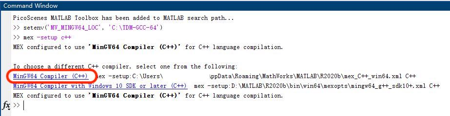
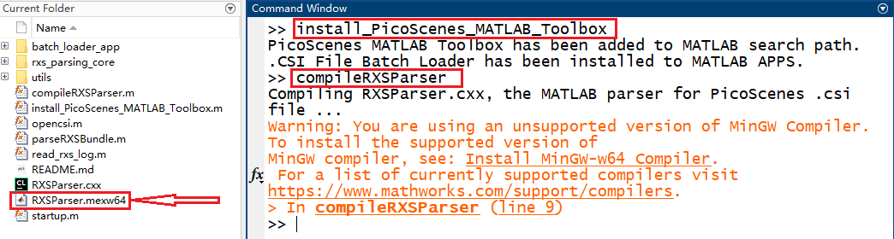
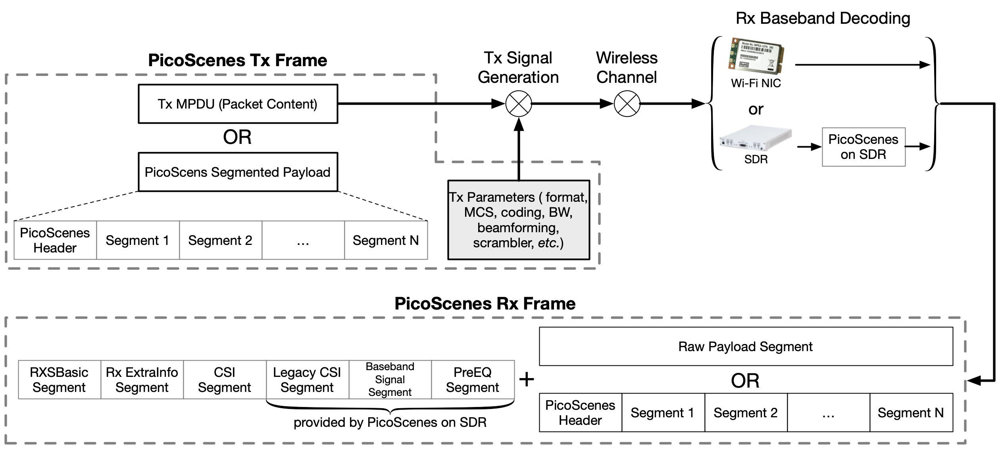

## Prerequisites

Since the PMT-Core and the PicoScenes main program rely on the [RxS-Parsing-Core library](https://github.com/wifisensing/RXS-Parsing-Core) to parse the CSI data, C/C++ compilers are required by PMT in different OSes. The following table shows the recommended (and also tested) working environments.

- Recommended Working Environments for PicoScenes MATLAB Toolbox

|                  | Linux                               | macOS                          | Windows                |
|------------------|-------------------------------------|-------------------------------|------------------------|
| **OS Version**   | Ubuntu 22.04 or its variants        | macOS Big Sur 11.2 or above   | Windows 10 or above    |
| **MATLAB Version** | MATLAB 2020b or above              | MATLAB 2020b or above         | MATLAB 2020b or above  |
| **Compiler**     | GCC 9.3+                            | Apple Clang 12+ (Xcode 12.4+) | TDM-GCC 64 (10.3+)     |

The following are the preparation steps for each supported OS.


### Preparation steps on Ubuntu 22.04 or above

- Run ``sudo apt install -y build-essential git`` to install GCC and git
- Install MATLAB (supporting R2021b to the latest R2022b);

### Preparation steps on macOS 12.3 and above

- Install Xcode 13.3 (or above) from macOS App Store 
- Install MATLAB (version R2021b or above);

### Preparation steps on Windows 10 or 11

- Install MATLAB (version R2021b or above);
- Install [TDM-GCC-64](https://jmeubank.github.io/tdm-gcc/)(choose MinGW-w64 based version, version 10.3+);
- By default, the installer will add ```<TDM-GCC-64 PATH>``` your system Environment Variables. Here we assume the installation path is ``C:\TDM-GCC-64``.
- Open MATLAB, run ``setenv('MW_MINGW64_LOC', 'C:\TDM-GCC-64')`` and then ``mex -setup C++`` in MATLAB Command Window.
- Click the option ``MinGW64 Compiler (C++)``

The following is a screenshot of setting up TDM-GCC-64 v10.3 in MATLAB R2020b.



## Obtain PicoScenes MATLAB Toolbox Core

PMT-Core can only be **git clone --recursive** from its git repo [PicoScenes MATLAB Toolbox Core](https://github.com/wifisensing/PicoScenes-MATLAB-Toolbox-Core). See the repo's README on how to obtain the toolbox.

## Install PMT-Core in MATLAB

Open MATLAB, change `Current Folder` to your ``PicoScenes-MATLAB-Toolbox-Core`` directory and run the following commands in Command Window:

```bash
install_PicoScenes_MATLAB_Toolbox
compileRXSParser
```

In a few seconds, if you see a message similar to the picture below, that means the installation is successful.



## Verify the installation

In MATLAB `Current Folder` or Ubuntu file explorer, navigate to `PicoScenes-MATLAB-Toolbox-Core/samples` directory, *drag'n'drop* the two sample .csi files into Command Window, then they will be parsed into cell arrays named `samples_9300` and `samples_x310`, respectively.

## Usage

You have three ways to parse a .csi file with PMT-Core:

1. Double-click the selected .csi file in MATLAB Current Folder
2. Drag'n'Drop one or multiple .csi files into MATLAB Command Window
3. run `opencsi(FILE_PATH)` in MATLAB Command Window, where `FILE_PATH` is the path to the selected .csi file

After parsing, you will see bundles with the same names as the .csi files in MATLAB Workspace.

### Structures of the PicoScenes Tx and Rx frames



Figure [PicoScenes Tx/Rx Frame Structure](#structures-of-the-picoscenes-tx-and-rx-frames) shows the Tx and Rx frame structures adopted by PicoScenes. PicoScenes frames consists of multiple `PicoScenes Segments` (segment). Each segment is a named and more importantly versioned container which holds heterogenous data structure or content.

**The PMT-Core parses the .csi files in two steps, the Raw Parsing and Bundled Parsing:**
- The Raw Parsing: PMT-Core first parses each Rx frame into a MATLAB `cell`. If a .csi file contains N Rx frames, the Raw Parsing stage will produce a cell array with N elements.
- The Bundled Parsing: This step tries to merge the cells generated by Raw Parsing into a unified structure, which is much easier for analysis. However, **the merging may fail** if the internal data structures are different across all measurements. And if it fails, a warning message will be shown.

### Data structures of the Raw Parsing

Each cell of the result array generated by Raw Parsing contains the following items. You may click the links on the left to view its internal structure.

| Variable | Description | Value type |
|---|---|---|
| [StandardHeader](#standard-header) | 802.11 MAC header | MATLAB struct |
| [RxSBasic](#rxsbasic-segment) | RxSBasic Segment | MATLAB struct |
| RxExtraInfo | [ExtraInfo](#extrainfo) Segment (measured at Rx end) | MATLAB struct |
| [MVMExtra](#mvmextra-segment) | Extra header information from AX210/AX200 NIC | MATLAB struct |
| CSI | [CSI](#csi-segment) measured from HT/VHT/HE/EHT-LTF field | MATLAB struct |
| LegacyCSI | [CSI](#csi-segment) measured from L-LTF field, measured by SDR frontend | MATLAB struct |
| MPDU | Raw MPDU data wo/ FCS bytes | uint8 array |
| [PicoScenesHeader](#picoscenes-common-header) | PicoScenes Common Header (optional) | MATLAB struct |
| TxExtraInfo | [ExtraInfo](#extrainfo) Segment (assembled and transmitted by Tx end, optional) | MATLAB struct |
| BasebandSignals | The complete time domain baseband signals | complex double array |

#### 1. Standard Header

| Variable | Description | Value type |
|---|---|---|
| [ControlField](#control-field) | The Frame Control field | MATLAB struct |
| Addr1 | Address 1 | uint8 |
| Addr2 | Address 2 | uint8 |
| Addr3 | Address 3 | uint8 |
| Fragment | Fragment Number | uint16 |
| Sequence | Sequence Number | uint16 |

##### Control Field

| Variable | Description | Value Type |
|---|---|---|
| Version | 802.11 Protocol Version 2-bit | uint16 |
| Type | Frame Type 2-bit | uint16 |
| SubType | Frame Subtype 4-bit | uint16 |
| ToDS | To DS bit | uint16 |
| FromDS | From DS bit | uint16 |
| MoreFrags | More Fragment bit | uint16 |
| Retry | Retry bit | uint16 |
| PowerManagement | Power Management bit | uint16 |
| More | More Data bit | uint16 |
| Protected | Protected Frame bit | uint16 |
| Order | +HTC/Order bit | uint16 |

#### RXSBasic Segment

| Variable | Description | Value type |
|---|---|---|
| DeviceType | Device Type ID (0x2100 for AX210, 0x2000 for AX200, 0x9300 for QCA9300, 0x5300 for IWL5300, 0x1234 for USRP, 0x24D2 for HackRF One) | uint16 |
| Timestamp | A us-level timestamp for the packet PPDU start | uint64 |
| SystemTime | The ns-level timestamp (since epoch) measured by the host driver | uint64 |
| CenterFreq | The *carrier frequency* of the current Rx channel in MHz | uint16 |
| ControlFreq | The *center frequency* of the **20-MHz control channel** of the current Rx channel, in MHz | uint16 |
| CBW | Channel BandWidth, 20/40/80/160 for HT20/HT40+ or -/VHT(or HE)80/VHT(or HE)160 format | uint16 |
| PacketFormat | 0/1/2/3/4 for NonHT, HT, VHT, HE-SU and HE-MU, respectively | int8 |
| PacketCBW | Channel BandWidth of the current packet, 20/40/80/160 for 20/40/80/160-MHz channel bandwidth | uint16 |
| GI | Guard Interval, 400/800/1600/3200 for 0.4/0.8/1.6/3.2us | uint16 |
| MCS | MCS index, in 802.11ac/ax format (no spatial streams) | uint8 |
| NumSTS | Number of Space-Time Streams | uint8 |
| NumESS | Number of Extra Spatial Sounding (an 802.11n only feature) | uint8 |
| NumRx | Number of Rx Chains | uint8 |
| NoiseFloor | Baseband noise floor | int8 |
| RSSI | RSSI value (dBm) | uint8 |
| RSSI1 | RSSI of the 1st radio chain | uint8 |
| RSSI2 | RSSI of the 2nd radio chain (meaningless for less than 2 Rx chain cases) | uint8 |
| RSSI3 | RSSI of the 3rd radio chain (meaningless for less than 3 Rx chain cases) | uint8 |

#### PicoScenes Common Header

| Variable | Description | Value type |
|---|---|---|
| MagicValue | a fixed value of 0x20150315, used for PicoScenes Common Header recognition | uint32 |
| Version | Version number of the PicoScenes Common Header | uint32 |
| DeviceType | Same as DeviceType in [StandardHeader](#standard-header) | uint16 |
| FrameType | The frame type ID defined by PicoScenes plugins | uint8 |
| TaskId | A general-purpose ID used for packet alignment | uint16 |
| TxId | A general-purpose ID used for Tx sequence tracking | uint16 |

#### ExtraInfo

| Variable | Description | Value type |
|---|---|---|
| HasLength | Checking if the length field presents in the ExtraInfo segment | uint8 |
| HasVersion | Checking if the version field presents in the ExtraInfo segment | uint8 |
| HasMacAddr_cur | Checking if the current MAC Address presents in the ExtraInfo segment | uint8 |
| HasMacAddr_rom | Checking if the hardware MAC Address presents in the ExtraInfo segment | uint8 |
| HasChansel | Checking if the QCA9300 CHANSEL field presents in the ExtraInfo segment | uint8 |
| HasBMode | Checking if the QCA9300 BMode field presents in the ExtraInfo segment | uint8 |
| HasEVM | Checking if the EVM field presents in the ExtraInfo segment | uint8 |
| HasTxChainMask | Checking if the Tx chain mask presents in the ExtraInfo segment | uint8 |
| HasRxChainMask | Checking if the Rx chain mask presents in the ExtraInfo segment | uint8 |
| HasTxpower | Checking if the Tx transmit power presents in the ExtraInfo segment | uint8 |
| HasTxTSF | Checking if the QCA9300 scheduled Tx time field presents in the ExtraInfo segment | uint8 |
| HasLastHwTxTSF | Checking if the QCA9300 last Tx time field presents in the ExtraInfo segment | uint8 |
| HasChannelFlags | Checking if the QCA9300/IWL5300 channel flag presents in the ExtraInfo segment | uint8 |
| HasTxNess | Checking if the Tx Number of Extra Spatial Sounding (NESS) field presents in the ExtraInfo segment | uint8 |
| HasTuningPolicy | Checking if the QCA9300 carrier frequency tuning policy field presents in the ExtraInfo segment | uint8 |
| HasPLLRate | Checking if the QCA9300 PLL rate field presents in the ExtraInfo segment | uint8 |
| HasPLLClkSel | Checking if the QCA9300 PLL clock selector field presents in the ExtraInfo segment | uint8 |
| HasPLLRefDiv | Checking if the QCA9300 PLL Reference clock divider field presents in the ExtraInfo segment | uint8 |
| HasAGC | Checking if the IWL5300 AGC field presents in the ExtraInfo segment | uint8 |
| HasAntennaSelection | Checking if the IWL5300 antenna permutation field presents in the ExtraInfo segment | uint8 |
| HasSamplingRate | Checking if the baseband sampling rate presents in the ExtraInfo segment | uint8 |
| HasCFO | Checking if the carrier frequency offset field presents in the ExtraInfo segment | uint8 |
| Length | Length of the current ExtraInfo | uint16 |
| Version | The version of the current ExtraInfo data structure | uint64 |
| MACAddressCurrent | The last 3 bytes of the current MAC Address | 1x3 uint8 |
| MACAddressROM | The last 3 bytes of the ROM MAC Address | 1x3 uint8 |
| CHANSEL | QCA9300 CHANSEL value | uint32 |
| BMode | QCA9300 BMode value | uint8 |
| EVM | QCA9300 error vector magnitude (EVM) values | int8 array |
| TxChainMask | Tx chain mask | uint8 |
| RxChainMask | Rx chain mask | uint8 |
| TxPower | Transmission power | uint8 |
| CF | Carrier frequency | uint64 |
| TXTSF | QCA9300 scheduled Tx time | uint32 |
| LastTXTSF | QCA9300 last Tx time | uint32 |
| ChannelFlags | Flag of current NIC status | uint16 |
| TxNess | The number of Tx extra spatial sounding | uint8 |
| TurningPolicy | QCA9300 carrier frequency tuning policy field | uint8 |
| PLLRate | QCA9300 PLL rate | uint16 |
| PLLClockSelect | QCA9300 PLL clock selector field | uint8 |
| PLLRefDiv | QCA9300 PLL Reference clock divider | uint8 |
| AGC | IWL5300 AGC value | uint8 |
| ANTSEL | IWL5300 antenna permutation value | 1x3 uint8 |
| SF | Baseband sampling rate | double |
| CFO | The estimated carrier frequency offset (CFO) | double |

#### MVMExtra Segment

| Variable | Description | Value type |
|---|---|---|
| FTMClock | 320 MHz clock tick of (3.125ns resolution) AX210/AX200 NIC (blocked for PSLP-FL user) | double |
| RateNFlags | Intel MVM flag for MCS and STS | double |

#### CSI Segment

| Variable | Description | Value type |
|---|---|---|
| DeviceType | Same as DeviceType in [StandardHeader](#standard-header) | double |
| FirmwareVersion | The firmware version used for CSI data extraction | double |
| PacketFormat | 0/1/2/3/4 for NonHT, HT, VHT, HE-SU and HE-MU, respectively | double |
| CBW | Same as CBW in [StandardHeader](#standard-header) | double |
| CarrierFreq | Carrier frequency in Hz | double |
| SamplingRate | Baseband sampling rate or bandwidth in Hz | double |
| SubcarrierBandwidth | The subcarrier bandwidth in Hz | double |
| NumTones | The number of OFDM subcarriers | uint16 |
| NumTx | Number of transmit Space-Time Streams | uint8 |
| NumRx | Number of Rx Chains | uint8 |
| NumESS | Number of Extra Spatial Sounding (an 802.11n only feature) | uint8 |
| AntSEL | IWL5300 antenna permutation value | uint8 |
| CSI | CSI data with size of `N_tone×N_sts×N_rx` | complex double array |
| Mag | CSI magnitude data with size of `N_tone×N_sts×N_rx` | double array |
| Phase | CSI phase data with size of `N_tone×N_sts×N_rx` | double array |
| SubcarrierIndex | the indices of OFDM subcarriers | int16 array |

The MATLAB parser performs additional pre-processing to the raw CSI data:

1. interpolate the 0-th and other *missing* pilot subcarriers for the CSI
2. calculate the norm of CSI and save to "Mag"
3. unwrap the phase into "Phase"
4. perform CSD removal to "Phase", which removes the additional phase slope introduced by CSD (cyclic shift delay)
