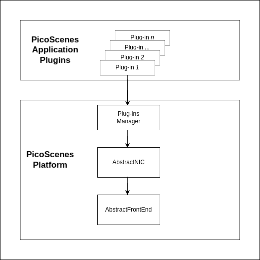
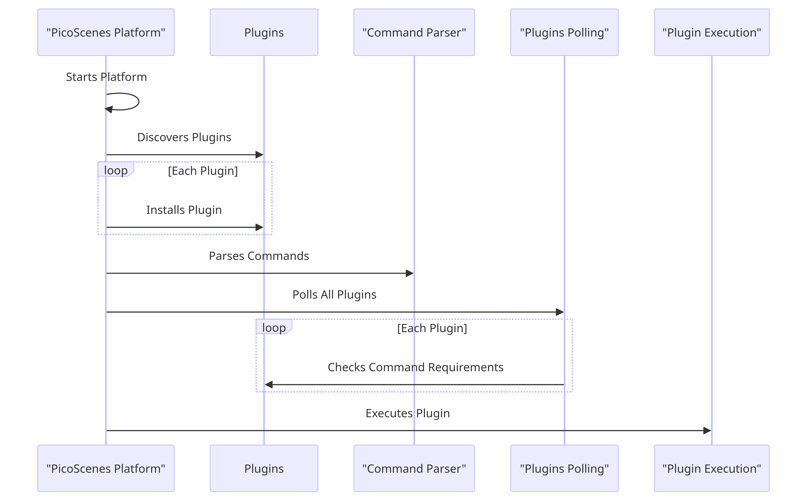
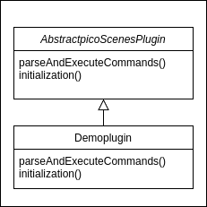
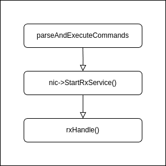
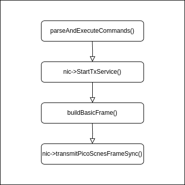
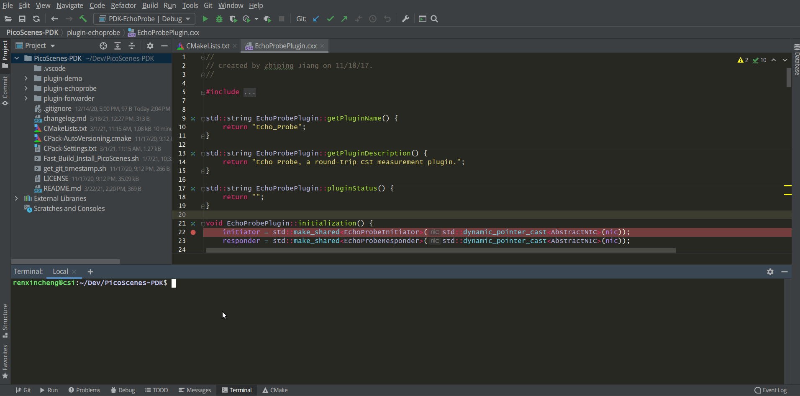

**Author:** Tian Teng, Xidian University, tengtianmoemoe@gmail.com

Before creating your own PicoScenes plugins from scratch, you have seven steps to gradually develop your understanding of the PicoScenes architecture and the coding skillset. During this process, you will learn how to git clone PS-PDK code, compile it, modify it, debug it, and imitate it. You will also have a general understanding of `modern C++` development on the Linux platform.

## Prerequisites

PicoScenes Plugin Development Kit (PS-PDK), as a standard C++ library, includes the PicoScenes `C/C++ headers` and `libraries`. If you have installed PicoScenes software, PS-PDK is already in your system. The headers and the binary library files are installed at `/usr/local/PicoScenes/include/PicoScenes` and `/usr/local/PicoScenes/lib`, respectively. You may refer to the document [installation](installation.md) to ensure your installation.

### Install necessary development dependencies

Run the following command to install the dependencies for PS-PDK development.

```bash
sudo apt install -y git cmake build-essential libboost-all-dev libssl-dev libcpprest-dev libsodium-dev libfmt-dev libuhd-dev libopenblas-dev libfftw3-dev pkg-config
```

### Clone, build and install PicoScenes PDK project

Run the following command to `git clone` the PicoScenes-PDK project

```bash
git clone https://github.com/wifisensing/PicoScenes-PDK --recursive
```

If PicoScenes and all the development dependencies are successfully installed, you can run the following command to build and install the three plugins of PicoScenes-PDK project.

```bash
cd PicoScenes-PDK # or cd to the cloned directory
./Fast_Build_Install_Plugin.sh
``` 

`Fast_Build_Install_Plugin.sh` is a bash script with the following content, which rebuilds the plugins and the .deb package and install the .deb package.

```bash
#!/bin/bash

scriptDir="$(cd "$(dirname "${BASH_SOURCE[0]}" )" && pwd )"

sudo apt purge picoscenes-plugins-demo-echoprobe-forwarder -y

cd $scriptDir && rm -rf $scriptDir/build && mkdir $scriptDir/build && cd $scriptDir/build
cmake .. && make package -j`nproc`

cd $scriptDir/build && sudo dpkg -i ./picoscenes*.deb
``` 

If everything goes fine, the above command rebuilds and reinstalls the latest PS-PDK repository.

### Optional Feature Prerequisites

We recommand JetBrains **CLion** as the IDE for PicoScenes plugin development.

## Developing PicoScenes Plugins

### PicoScenes Plugin Overview

The following image illustrates the relationship between PicoScenes-plugin and PicoScenes.  



The top box is labeled "PicoScenes Application Plugins," which contains multiple sub-boxes marked as "Plugin-1," "Plugin-2," through "Plugin-n," indicating that there are multiple plugins available for use by the PicoScenes platform. These plugins are managed through an intermediary box, "Plugins Manager," signifying that all plugins are uniformly managed by this plugin manager.   

The process begins with the initiation of the platform, followed by the automatic detection of all available plugins. After detection, each plugin is systematically installed. Once the installation is complete, the system [parses user commands](#picoscenes-plugin-folder-structure) and proceeds to poll each plugin to verify if they meet the requirements of the commands. Upon confirmation, the system executes the corresponding plugins.



The plugin has the capability to control all hardware on the platform, with all functions and APIs within its realm of control. It is capable of [receiving](#how-to-receive-packages) and [transmitting](#how-to-transmit-packages) data flows, including WiFi packets. Once the hardware platform captures a packet, it forwards this data to all plugins, ensuring that each one receives the packet.    

"Imitation is not just the sincerest form of flattery - it's the sincerest form of learning." -- George Bernard Shaw

::: tip
You can learn how to write plugins step by step following the tutorial, or you can view the complete code in the [repository](https://github.com/wifisensing/PicoScenes-PDK/).
:::

### PicoScenes Plugin folder structure

The entire PS-PDK project is managed by `CMake` and contains three working plugins, a Demo plugin, the EchoProbe, and UDP-forwarder.

`PicoScenes-PDK/CMakeLists.txt`

```cmake
# ...
add_subdirectory(plugin-demo)
add_subdirectory(plugin-echoprobe)
add_subdirectory(plugin-forwarder)
# ...
```

- `add_subdirectory(plugin-demo)`: searches CMakeLists.txt in `plugin-demo`

`PicoScenes-PDK/plugin-demo/CMakeLists.txt`

```cmake
# PicoScenes-PDK/plugin-demo/CMakeLists.txt

# The PicoScenes Plugins MUST be named in "PDK-xxx" pattern.
ADD_LIBRARY(PDK-demo SHARED DemoPlugin.cxx)
TARGET_LINK_LIBRARIES(PDK-demo  ${Boost_LIBRARIES} fmt::fmt SystemTools)
install(TARGETS PDK-demo  DESTINATION .)
```

DemoPlugin Inherits from AbstractPicoScenesPlugin. Below are the properties and methods in DemoPlugin.

`DemoPlugin.hxx`

```cpp
// DemoPlugin.hxx

#include <iostream>
#include <mutex>
#include <PicoScenes/AbstractPicoScenesPlugin.hxx>
#include <PicoScenes/MAC80211CSIExtractableNIC.hxx>

class DemoPlugin : public AbstractPicoScenesPlugin {
public:

    // Get the name of the plugin
    std::string getPluginName() override;

    // Get the description of the plugin
    std::string getPluginDescription() override;

    // Get the status of the plugin
    std::string pluginStatus() override;

    // Get the supported device types by the plugin
    std::vector<PicoScenesDeviceType> getSupportedDeviceTypes() override;

    // Perform initialization tasks for the plugin
    void initialization() override;

    // Get the options description for the plugin
    std::shared_ptr<boost::program_options::options_description> pluginOptionsDescription() override;

    // Parse and execute commands for the plugin
    void parseAndExecuteCommands(const std::string &commandString) override;

    // Create an instance of the DemoPlugin
    static std::shared_ptr<DemoPlugin> create()
    {
        return std::make_shared<DemoPlugin>();
    }
private:

    // Options description for the plugin
    std::shared_ptr<po::options_description> options;
};

// Alias the create function to 'initPicoScenesPlugin' using BOOST_DLL_ALIAS
BOOST_DLL_ALIAS(DemoPlugin::create, initPicoScenesPlugin)
```

These methods are implemented in `Demoplugin.cxx`

`DemoPlugin.cxx`

```cpp
// DemoPlugin.cxx
#include "DemoPlugin.hxx"

std::string DemoPlugin::getPluginName() {
    return "PicoScenes Demo Plugin";
}

std::string DemoPlugin::getPluginDescription() {
    return "Demonstrate the PicoScenes Plugin functionality";
}

std::string DemoPlugin::pluginStatus() {
    return "this method returns the status of the plugin.";
}

std::vector<PicoScenesDeviceType> DemoPlugin::getSupportedDeviceTypes() {
    static auto supportedDevices = std::vector<PicoScenesDeviceType>{PicoScenesDeviceType::IWL5300, PicoScenesDeviceType::QCA9300, PicoScenesDeviceType::IWLMVM_AX200, PicoScenesDeviceType::IWLMVM_AX210, PicoScenesDeviceType::VirtualSDR, PicoScenesDeviceType::USRP, PicoScenesDeviceType::SoapySDR};
    return supportedDevices;
}

void DemoPlugin::initialization() {
    // Create an options description for the DemoPlugin with a specific name and line length
    options = std::make_shared<po::options_description>("Demo Options", 120);

}

std::shared_ptr<boost::program_options::options_description> DemoPlugin::pluginOptionsDescription() {
    return options;
}

void DemoPlugin::parseAndExecuteCommands(const std::string &commandString) {

}
```

### How to parse commands

Add the following content in `DemoPlugin.cxx`

`DemoPlugin.cxx`

```cpp
// DemoPlugin.cxx

...
...
void DemoPlugin::initialization() {
    // Create an options description for the DemoPlugin with a specific name and line length
    options = std::make_shared<po::options_description>("Demo Options", 120);

    // Add a command-line option for the DemoPlugin
    options->add_options()
            ("demo", po::value<std::string>(), "--demo <param>");
}

...
void DemoPlugin::parseAndExecuteCommands(const std::string &commandString) {

    // Create a variables map to store parsed options
    po::variables_map vm;

    // Parse the command string using Boost.ProgramOptions
    auto parsedOptions = po::command_line_parser(po::split_unix(commandString))
        .options(*pluginOptionsDescription())
        .allow_unregistered()
        .style(po::command_line_style::unix_style & ~po::command_line_style::allow_guessing)
        .run();

    // Store the parsed options in the variables map
    po::store(parsedOptions, vm);

    // Notify the variables map about the parsed options
    po::notify(vm);

    if (vm.count("demo")) {
        auto optionValue = vm["demo"].as<std::string>();
        LoggingService_Plugin_info_print("Plugin has been installed, its param is {}", std::string(optionValue));
    }
}
```

**Compile and run plugin** 

Compile the plugin using `./Fast_Build_Install_Plugin.sh`

```bash
./Fast_Build_Install_Plugin.sh
```

Open **terminal**, run Picoscenes platform

```bash
PicoScenes "-d debug
            --plugin-dir <your-plugin-dir>/PicoScenes-PDK;
            -i virtualsdr
            --demo HelloPicoScenes"
```

If successfully executed, you will see the following content in the console.

```bash
[17:31:51.183948] [Plugin  ] [Info ] Plugin has been installed, its param is HelloPicoScenes
```

The command options, ```"-d debug  --plugin-dir <your-plugin-dir>/PicoScenes-PDK; -i virtualsdr  --demo HelloPicoScenes"```, have the following interpretations:

- `-d debug`: Modifies the display level of the logging service to debug
- `--plugin`: Search plugin's directory  ```<your-plugin-dir>/PicoScenes-PDK``` is your plugin's location
- `-i virtualsdr`: Switches the device to virtualsdr
- `--demo HelloPicoScenes`: enable demo command, "HelloPicoScenes" is the parameter

PicoScenes uses polymorphism to manage plugins. Developers should inherit from `AbstractPicoScenesPlugin` to develop their plugins. The following diagram shows the inheritance.



The **initialization()** method defines plugin's commands. **parseAndExecuteCommands()** method parses commands and arguments.

```cpp
void DemoPlugin::initialization() {
    // Create an options description for the DemoPlugin with a specific name and line length
    options = std::make_shared<po::options_description>("Demo Options", 120);

    // Add a command-line option for the DemoPlugin
    options->add_options()
            ("demo", po::value<std::string>(), "--demo <param>");
}
```

- `options->add_options()`: Define command "demo" and set parameter's type

```cpp
void DemoPlugin::parseAndExecuteCommands(const std::string &commandString) {
    ...
    if (vm.count("demo")) {
        auto optionValue = vm["demo"].as<std::string>();
        LoggingService_Plugin_info_print("Plugin has been installed, its param is {}",std::string(optionValue));
    }
}
```

- `vm["demo"].as<std::string>()`: Get parameters "HelloPicoScenes"

### How to receive packages

You have now learned how to define a command and parse it. In the upcoming example, you will learn how to make a receive/send plugin.

Before writing a plugin for `receiving` signals, understand the process of writing a receive plugin.



- `parseAndExecuteCommands()`: Parse plugin command and parameters
- `nic->startRxService()`:  Start receiving signals from different devices
- `rxHandle()`: Handle receiving signals

Add plugin commands and activate the receive mode

`DemoPlugin.cxx`

```cpp
void DemoPlugin::parseAndExecuteCommands(const std::string &commandString) {
    // Create a variables map to store parsed options
    po::variables_map vm;

    // Define the command line options style
    auto style = pos::allow_long | pos::allow_dash_for_short |
                 pos::long_allow_adjacent | pos::long_allow_next |
                 pos::short_allow_adjacent | pos::short_allow_next;

    // Parse the command string using Boost.ProgramOptions and store options in the variables map
    po::store(po::command_line_parser(po::split_unix(commandString)).options(*options).style(style).allow_unregistered().run(), vm);

    // Notify the variables map about the parsed options
    po::notify(vm);

    // Check if the "demo" option is present
    if (vm.count("demo")) {
        // Get the value of the "demo" option
        auto modeString = vm["demo"].as<std::string>();

        // Check if the modeString contains "logger" and start the Rx service accordingly
        if (modeString.find("logger") != std::string::npos) {
            nic->startRxService();
        }
    }
}
```

`DemoPlugin.hxx`

```cpp
class DemoPlugin : public AbstractPicoScenesPlugin {
public:
    ...
    ...
    // Handle received frames in the plugin
    void rxHandle(const ModularPicoScenesRxFrame &rxframe) override;

private:
    std::shared_ptr<po::options_description> options;
};
```

Implement `rxHandle()` in `DemoPlugin.cxx`

```cpp
void DemoPlugin::rxHandle(const ModularPicoScenesRxFrame &rxframe) {
    LoggingService_debug_print("This is my rxframe: {}",rxframe.toString());
}
```

Build the plugin and run in terminal

```bash
./Fast_Build_Install_Plugin.sh
```

```bash
PicoScenes "-d debug
            --bp
            --plugin-dir <your-plugin-dir>/PicoScenes-PDK;
            -i virtualsdr
            --rx-from-file sample5
            --demo logger"
```

- `--rx-from-file`: Read signals from file sample.bbsignal

If successfully running, the terminal will show

```bash
[17:34:09.811501] [Platform] [Debug] This is my rxframe: RxFrame:{RxSBasic:[device=USRP(SDR), center=2412, control=2412, CBW=20, format=HT, Pkt_CBW=20, MCS=0, numSTS=1, GI=0.8us, UsrIdx/NUsr=(0/1), timestamp=1288, system_ns=1704015249809485863, NF=-78, RSS=-7], RxExtraInfo:[len=24, ver=0x2, sf=20.000000 MHz, cfo=0.000000 kHz, sfo=0 Hz], SDRExtra:[scrambler=39, packetStartInternal=25761, rxIndex=25760, rxTime=0.001288, decodingDelay=0.0620708466, lastTxTime=0, sigEVM=2.4], (HT)CSI:[device=USRP(SDR), format=HT, CBW=20, cf=2412.000000 MHz, sf=20.000000 MHz, subcarrierBW=312.500000 kHz, dim(nTones,nSTS,nESS,nRx,nCSI)=(56,1,0,1,1), raw=0B], LegacyCSI:[device=USRP(SDR), format=NonHT, CBW=20, cf=2412.000000 MHz, sf=20.000000 MHz, subcarrierBW=312.500000 kHz, dim(nTones,nSTS,nESS,nRx,nCSI)=(52,1,0,1,2), raw=0B], BasebandSignal:[(float) 3045x1], MACHeader:[type=[MF]Reserved_14, dest=00:16:ea:12:34:56, src=00:16:ea:12:34:56, seq=8, frag=0, mfrags=0], PSFHeader:[ver=0x20201110, device=QCA9300, numSegs=1, type=10, taskId=55742, txId=0], TxExtraInfo:[len=8, ver=0x2], MPDU:[num=1, total=75B]}
```

### How to transmit packages

The process of frame transmitting is similar to frame receiving.



- `nic->startTxService()`:  Start transmitting signals process
- `buildBasicFrame`: Initialize and build Packet frame
- `nic->transmitPicoScenesFrameSync(*txframe);`: deliver frame to phy layer

Add method `buildBasicFrame()` in `DemoPlugin.hxx`

```cpp
class DemoPlugin : public AbstractPicoScenesPlugin {
public:
    ...

    // Handle received frames in the plugin
    void rxHandle(const ModularPicoScenesRxFrame &rxframe) override;

    // Build a basic transmission frame for the plugin
    [[nodiscard]] std::shared_ptr<ModularPicoScenesTxFrame> buildBasicFrame(uint16_t taskId = 0) const ;

private:
    std::shared_ptr<po::options_description> options;
};
```

Implement `buildBasicFrame()` in `DemoPlugin.cxx`

```cpp
std::shared_ptr<ModularPicoScenesTxFrame> DemoPlugin::buildBasicFrame(uint16_t taskId) const
{
    auto frame = nic->initializeTxFrame();

    /**
     * The platform parser will parse the Tx parameters options and store the results in AbstractNIC.
     */

    frame->setTxParameters(nic->getUserSpecifiedTxParameters());
    frame->setTaskId(taskId);
    auto sourceAddr = MagicIntel123456;
    frame->setSourceAddress(sourceAddr.data());
    frame->set3rdAddress(nic->getFrontEnd()->getMacAddressPhy().data());

    return frame;
}
 {
            nic->startTxService();

            // Generate a random task ID within a specified range
            auto taskId = SystemTools::Math::uniformRandomNumberWithinRange<uint16_t>(9999, UINT16_MAX);

            // Build a basic transmission frame with the generated task ID
            auto txframe = buildBasicFrame(taskId);

            // Transmit the PicoScenes frame synchronously
            nic->transmitPicoScenesFrameSync(*txframe);
        }
    }
}
```

Build the plugin and run in terminal

```bash
./Fast_Build_Install_Plugin.sh
```

```bash
PicoScenes "-d debug
            --bp --plugin-dir <your-plugin-dir>/PicoScenes-PDK;
            -i virtualsdr
            --demo injector"
```

```bash
[18:15:35.993309] [SDR     ] [Debug] virtualsdr(Virtual(SDR))-->TxFrame:{MACHeader:[type=[MF]Reserved_14, dest=00:16:ea:12:34:56, src=00:16:ea:12:34:56, seq=0, frag=0, mfrags=0], PSFHeader:[ver=0x20201110, device=QCA9300, numSegs=0, type=0, taskId=33196, txId=0], tx_param[preset=DEFAULT, type=HT, CBW=20, MCS=0, numSTS=1, Coding=BCC, GI=0.8us, numESS= , sounding(11n)=1]} | PPDU: 2480
```

## Debug PicoScenes plugins

Since the plugin .so file cannot run by itself, a tricky problem of plugin development emerges, `how to debug a plugin?`

Xincheng Ren, one of our contributors, records a .gif video describing the plugin debug process. In this video, we use JetBrains CLion as our IDE. To debug the EchoProbe plugin, rather than specifying the .so plugin file as the `debug main program`, you must specify the PicoScenes main program at `/usr/local/PicoScenes/bin/` to be the `debug main program`. Second, you should also add `--plugin-dir /path-to-plugin` program option to tell PicoScenes main program to load your plugins.



You can download this .gif video from [Debug Plugin](../images/Plugin-Debug.gif).
```bash
    auto style = pos::allow_long | pos::allow_dash_for_short |
                 pos::long_allow_adjacent | pos::long_allow_next |
                 pos::short_allow_adjacent | pos::short_allow_next;

    // Parse the command string using Boost.ProgramOptions and store options in the variables map
    po::store(po::command_line_parser(po::split_unix(commandString)).options(*options).style(style).allow_unregistered().run(), vm);

    // Notify the variables map about the parsed options
    po::notify(vm);

    // Check if the "demo" option is present
    if (vm.count("demo")) {
        // Get the value of the "demo" option
        auto modeString = vm["demo"].as<std::string>();

        // Check if the modeString contains "logger" and start the Rx service accordingly
        if (modeString.find("logger") != std::string::npos) {
            nic->startRxService();
        }
        // Check if the modeString contains "injector" and start the Tx service with basic frame transmission
        else if (modeString.find("injector") != std::string::npos) {
            nic->startTxService();

            // Generate a random task ID within a specified range
            auto taskId = SystemTools::Math::uniformRandomNumberWithinRange<uint16_t>(9999, UINT16_MAX);

            // Build a basic transmission frame with the generated task ID
            auto txframe = buildBasicFrame(taskId);

            // Transmit the PicoScenes frame synchronously
            nic->transmitPicoScenesFrameSync(*txframe);
        }
    }
}
```

Build the plugin and run in terminal

```bash
./Fast_Build_Install_Plugin.sh
```

```bash
PicoScenes "-d debug
            --bp --plugin-dir <your-plugin-dir>/PicoScenes-PDK;
            -i virtualsdr
            --demo injector"
```

```bash
[18:15:35.993309] [SDR     ] [Debug] virtualsdr(Virtual(SDR))-->TxFrame:{MACHeader:[type=[MF]Reserved_14, dest=00:16:ea:12:34:56, src=00:16:ea:12:34:56, seq=0, frag=0, mfrags=0], PSFHeader:[ver=0x20201110, device=QCA9300, numSegs=0, type=0, taskId=33196, txId=0], tx_param[preset=DEFAULT, type=HT, CBW=20, MCS=0, numSTS=1, Coding=BCC, GI=0.8us, numESS= , sounding(11n)=1]} | PPDU: 2480
```

## Debug PicoScenes plugins

Since the plugin .so file cannot run by itself, a tricky problem of plugin development emerges, `how to debug a plugin?`

Xincheng Ren, one of our contributors, records a .gif video describing the plugin debug process. In this video, we use JetBrains CLion as our IDE. To debug the EchoProbe plugin, rather than specifying the .so plugin file as the `debug main program`, you must specify the PicoScenes main program at `/usr/local/PicoScenes/bin/` to be the `debug main program`. Second, you should also add `--plugin-dir /path-to-plugin` program option to tell PicoScenes main program to load your plugins.


You can download this .gif video from [Debug Plugin](../images/Plugin-Debug.gif).