## Published Papers by PicoScenes Users

- Viktor Erdélyi, Kazuki Miyao, Akira Uchiyama, Tomoki Murakami, ["Poster: Activity Recognition Using CSI Backscatter with Commodity Wi-Fi"](https://dl.acm.org/doi/abs/10.1145/3643832.3661396), 2024, MobiSys.
- Hao Yin, Murali Ramanujam, Joe Schaefer, Stan Adermann, Srihari Narlanka, Perry Lea, Ravi Netravali, Krishna Chintalapudi, ["ADR-X: ANN-Assisted Wireless Link Rate Adaptation for Compute-Constrained Embedded Gaming Devices"](https://www.usenix.org/conference/nsdi24/presentation/yin), 2024 NSDI.
- N.Ikuo, ["CSI2PC: 3D Point Cloud Reconstruction Using CSI"](https://ieeexplore.ieee.org/abstract/document/10454882), 2024 IEEE 21st Consumer Communications & Networking Conference (CCNC).
- C.-H.Lee, H.Choi, Y.Arakawa, D.-H.Kim, J.-D.Kim, ["Bilatangulation: A Novel Measurement Error Compensation Method for Wi-Fi Indoor Positioning with Two Anchors"](https://ieeexplore.ieee.org/abstract/document/10643056), 2024 IEEE Access.
- T.-W.Hsu and H.-Y.Hsieh, ["Robust Multi-User Pose Estimation Based on Spatial and Temporal Features from WiFi CSI"](https://ieeexplore.ieee.org/abstract/document/10623053), ICC 2024 - IEEE International Conference on Communications.
- V.V.Ratnam, ["WiDRa: Enabling Millimeter-Level Differential Ranging Accuracy in Wi-Fi Using Carrier Phase"](https://ieeexplore.ieee.org/abstract/document/10556775), 2024 in IEEE Journal on Selected Areas in Communications.
- L.Zhang, ["Toward Robust and Effective Behavior Based User Authentication With Off-the-shelf Wi-Fi"](https://ieeexplore.ieee.org/abstract/document/10597619), 2024 IEEE Transactions on Information Forensics and Security.
- Xin Na, Xiuzhen Guo, Zihao Yu, Jia Zhang, Yuan He, Yunhao Liu, ["Leggiero: Analog WiFi Backscatter with Payload Transparency"](https://dl.acm.org/doi/abs/10.1145/3581791.3596835), 2023 MobiSys.
- Pengming Hu, Weidong Yang, Xuyu Wang, Shiwen Mao, Erbo Shen, ["WiWm-EP: Wi-Fi CSI-based Wheat Moisture Detection Using Equivalent Permittivity"](https://ieeexplore.ieee.org/abstract/document/10225988), IEEE INFOCOM 2023.
- Xinyue Fang, Jianwei Liu, Yike Chen, Jinsong Han, Kui Ren, Gang Chen, ["Nowhere to Hide: Detecting Live Video Forgery via Vision-WiFi Silhouette Correspondence"](https://ieeexplore.ieee.org/abstract/document/10228947), IEEE INFOCOM 2023-IEEE Conference on Computer Communications, 2023.
- Shiva Raj Pokhrel, Jonathan Kua, Deol Satish, Philip Williams, Arkady Zaslavsky, Seng W. Loke, Jinho Choi, ["Deakin RF-Sensing: Experiments on Correlated Knowledge Distillation for Monitoring Human Postures With Radios"](https://ieeexplore.ieee.org/abstract/document/10271124), IEEE Sensors Journal, 2023.
- Viktor Erdélyi, Kazuki Miyao, Akira Uchiyama, Tomoki Murakami, ["Towards Activity Recognition Using Wi-Fi CSI from Backscatter Tags"](https://ieeexplore.ieee.org/abstract/document/10150323), 2023 IEEE International Conference on Pervasive Computing and Communications Workshops and other Affiliated Events (PerCom Workshops).
- Wenli Jiao, Ju Wang, Yelu He, Xiangdong Xi, Fuwei Wang, ["SoilTAG: Fine-Grained Soil Moisture Sensing Through Chipless Tags"](https://ieeexplore.ieee.org/abstract/document/10061277), 2023 IEEE Transactions on Mobile Computing (Early Access).
- Guoxuan Chi, Zheng Yang, Jingao Xu, Chenshu Wu, Jialin Zhang, Jianzhe Liang, Yunhao Liu, ["Wi-drone: wi-fi-based 6-DoF tracking for indoor drone flight control"](https://dl.acm.org/doi/abs/10.1145/3498361.3538936), 2022 MobiSys.
- Pengming Hu, Weidong Yang, Xuyu Wang, Shiwen Mao, Chao Niu, ["WiPd: Contactless Water-Injected Pork Detection Using Commodity WiFi Devices"](https://ieeexplore.ieee.org/abstract/document/9973501), 2022 IEEE 19th International Conference on Mobile Ad Hoc and Smart Systems (MASS).
- Ruilin Wang, Xiaolin Zhou, Bo Wang, Zhi Zheng, Yongxin Guo, ["A Subcarrier Selection Method for Wi-Fi-based Respiration Monitoring using IEEE 802.11ac/ax Protocols"](https://ieeexplore.ieee.org/abstract/document/9790274), 2022 IEEE MTT-S International Microwave Biomedical Conference (IMBioC).
- Jie Zhang, Zhongmin Wang, Kexin Zhou, Ruohan Bai, ["A Novel Drinking Category Detection Method Based on Wireless Signals and Artificial Neural Network"](https://www.htmlpi.com/1099-4300/24/11/1700), Entropy, 2022.
- Xiaoyu Ma, Wei Xi, Zuhao Chen, Han Hao, Jizhong Zhao, ["ECC: Passenger Counting in the Elevator Using Commodity WiFi"](https://www.htmlpi.com/2076-3417/12/14/7321), Applied Sciences, 2022.
- Qing Yang, Tianzhang Xing, Zhiping Jiang, Junfeng Wang, Jingyi He, ["WiRD: Real-Time and Cross Domain Detection System on Edge Device"](https://link.springer.com/chapter/10.1007/978-3-030-95388-1_23), Algorithms and Architectures for Parallel Processing, 2022.
- Xiaoyu Ma, Hui He, Hui Zhang, Wei Xi, Zuhao Chen, Jizhong Zhao, ["Measuring and Modeling Multipath of Wi-Fi to Locate People in Indoor Environments"](https://ieeexplore.ieee.org/abstract/document/9763705), 2021 IEEE 27th International Conference on Parallel and Distributed Systems (ICPADS).

## Affiliations using PicoScenes

The following grid lists the affiliations that use PicoScenes platform in their latest research.

### China Mainland Users

|  |  |  |  |
|:--:|:--:|:--:|:--:|
| 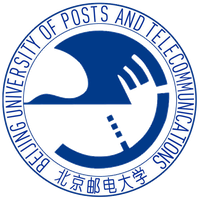 |  |  | 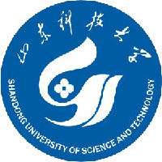 |
|  | 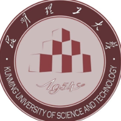 | 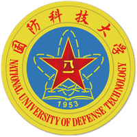 |  |
|  | 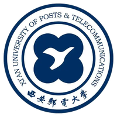 |  | 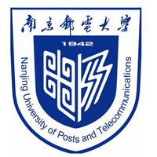 |
|  |  |  |  |
| 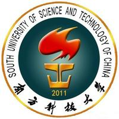 |  |  |  |
|  | 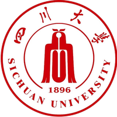 |  |  |
|  |  |  |  |
|  |  |  |  |
|  |  |  |  |
|  | 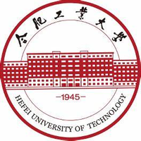 | 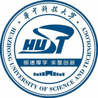 |  |
|  |  | 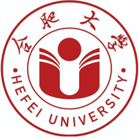 |  |
| 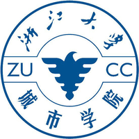 |  |  | 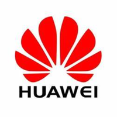 |

### Global Users

|  |  |  |  |
|:--:|:--:|:--:|:--:|
|  |  |  |  |
|  |  |  |  |
|  |  |  |  |
|  |  |  | 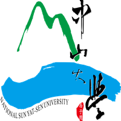 |
|  |  |  |  |
|  |  |  |  |
|  |  | 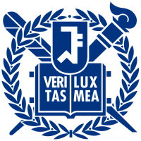 | 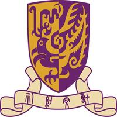 |
|  |  |  |  |
|  |  |  |  |
|  |  |  |  |
|  |  | 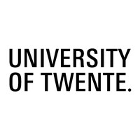 |  |
|  | 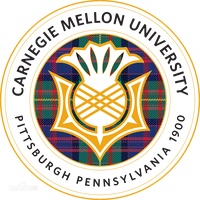 |  |  |
|  | 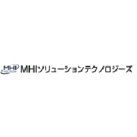 |  |  |
|  | 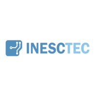 |  |  |
|  |  |  |  |
|  | 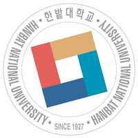 |  |  |
|  |  | 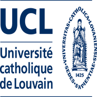 |  |
|  |  |  |  |
|  |  |  | 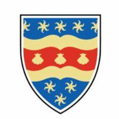 |
|  |  |  |  |
|  | 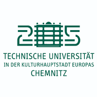 | | |

::: tip
1. All affiliations listed above are identified from the collected software usage data. Data collection is expressly stated in the [PicoScenes Software End User License Agreement](eula.md).2. The list of affiliations is updated periodically and may not reflect real-time changes.
:::
