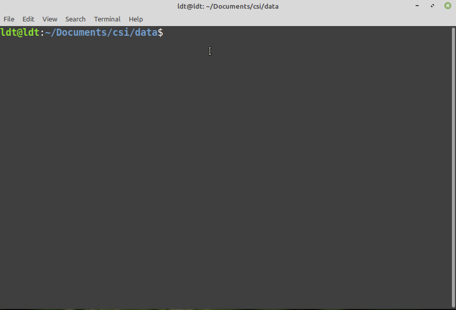

# Why Use PicoScenes

> **Hint:** This page is under active editing.

## The first public-available 802.11ax-format CSI measurement platform

To the best of our knowledge, PicoScenes is currently (Oct. 2021) the **only** Wi-Fi sensing platform software that supports the 802.11ax-format CSI measurement. Based on the Intel Wireless-AX200 Wi-Fi NIC, PicoScenes can measure CSI for all Wi-Fi traffics with any formats (802.11a/g/n/ac/ax), any bandwidths (20/40/80/160 MHz), and even any target destinations (all overheard frames in monitor mode).

## Concurrent CSI measurement from multiple Wi-Fi NICs or SDR devices

To the best of our knowledge, PicoScenes is currently (Oct. 2021) the **only** Wi-Fi sensing platform software that supports concurrent CSI measurement from multiple Wi-Fi NICs by one single computer.

This feature significantly reduces the complexity of setting up and managing a multi-NIC CSI measurement. Taking our dual-NIC ThinkPad X201 as an example, researchers can perform the round-trip or concurrent CSI measurement with just one laptop. We have even set up a 27-NIC array which is just impossible with the previous one-PC per NIC architecture.

To achieve this goal, we rewrote the CSI extraction logic of the AX200, QCA9300, and IWL5300 kernel drivers. Moreover, multi-threading is one of the fundamental designs of the PicoScenes platform. In fact, the PicoScenes platform assigns at least five threads for each frontend (Wi-Fi COTS NICs or SDR) and its plugins.

## Support the most models of CSI-extractable hardware

PicoScenes provides the broadest hardware platform for researchers to explore CSI. It currently supports three commercial CSI-extractable Wi-Fi NICs, AX200, QCA9300, and IWL5300, and is the only platform that supports CSI extraction from the USRP-based SDR devices.

## Super easy installation with auto-update support

Compared to the existing CSI tools, the PicoScenes platform has an unprecedentedly simplified installation process. Once you have installed the latest Ubuntu 22.04 LTS (or its variant), all that needs to be done is just three steps: downloading a KB-size .deb file, double-click installing it, and at last installing PicoScenes via the popular `apt install` approach. View [Installation](installation.md) for more details.

We use Continuous Integration (CI) to boost the development-release cycle of PicoScenes. Once we push a code update, CI will automatically perform the building, testing, binary packaging, and APT repository updating. You will receive the update notification from the built-in update manager within an hour.

## Accessing the unlocked hardware features of the QCA9300 and IWL5300

## Adopting SDR (USRP) in your Wi-Fi sensing research

## Obtaining complete RX PHY-layer information

## Fully control PHY-layer transmission

## Modern Wi-Fi protocols (802.11ac/ax w/ multi-user) support

## Use Virtual SDR Parse Signals

## In-situ CSI parsing & processing

## Prototype your own advanced CSI measurement protocol

## Technical support--- least technical, most critical
